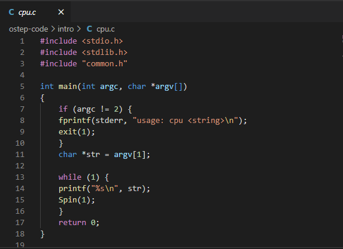
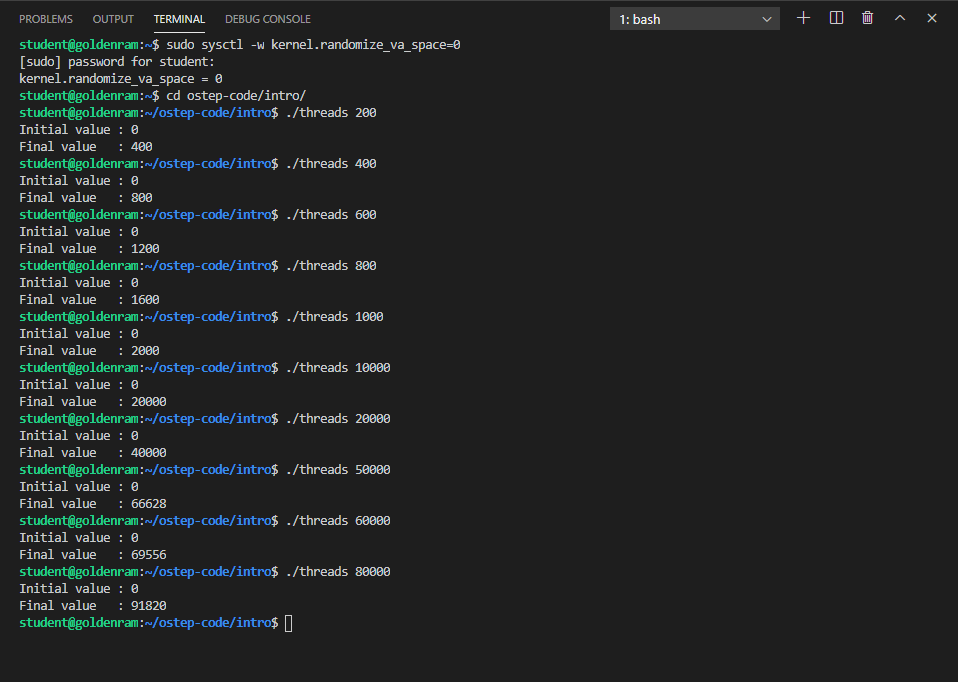

> ## 1. What happens when a computer program run?     
>  
>  The process
>    - **fetches** an instruction from memory,
>    - **decodes** the instruction, and
>    - **executes** the instruction.
>  This is the fundamental **Von Neumann** model of computing. 
>
{: .slide}

> ## Why do we need OS?
> 
> 
>  - What a programmer see is all code, lines of codes.
>  - Underneath, there is a complex ecosystem of hardware components. 
>  - How do we hide this complexity away from the programmers?
> 
{: .slide}

> ## 2. How do the OS help (1)?
>
>  This is possible due to **virtualization**.
>  - Virtualization: presents general, powerful, and easy-to-use **virtual** forms of 
>  **physical** computing resources to users (*programmers*). 
>  - The linkage between virtual interfaces and physical components are enabled through
>  the OS' **system calls** (or **standard library**).  
>
{: .slide}

> ## 3. How do the OS help (2)?
>
>  - Each physical component in a computing system is considered a resource. 
>  - The OS **manages** these resources so that multiple programs can access
>  these resources (through the corresponding virtual interface) at the same time.  
>  - This is called **concurrency**. 
{: .slide}

> ## 4. Hands-on 1: Getting started
>
> - Open a terminal (Windows Terminal or Mac Terminal). 
> - Run the following command to launch th 
> - Navigate to `/home/student/ostep-code/intro`
> - Open a terminal
> 
> 
{: .slide}

> ## Hands-on 2: CPU Virtualization 
> 
> - Navigate to `ostep-code/intro`
> - Click on `cpu.c` to view the file. 
> - *VSCode will recommend a C/C++ extension for this file type. You can select to install them or not*. 
> 
>
{: .slide}

> ## Hands-on 3: CPU Virtualization 
> 
> - Run the following in the terminal:
>
> ~~~
> $ cd ostep-code/intro
> $ gcc -Wall -o cpu cpu.c
> $ ./cpu A
> ~~~
> {: .language-bash} 
>
> - You will see letter A being printer out one-per-line continously. 
> - To interrupt the process, hit `Ctrl-C`. 
> 
>
{: .slide}

> ## How many CPU did we assign to the VM?
>
> > ## Answer     
> >  - 1
> >  - We can see this in csc331's Settings
> >  
> >
> {: .solution}
{: .challenge}

> ## Hands-on 4: CPU Virtualization 
> 
> - Next, run the following command in the terminal:
>
> ~~~
> $ (./cpu A &); (./cpu B &); (./cpu C &); (./cpu D)
> ~~~
> {: .language-bash}
>
> 
>
{: .slide}

> ## How many programs are trying to prin to the terminal *concurrently* and *continuously*?
>
> - 1
> - 2
> - 3
> - 4
>
> > ## Answer     
> >  - 4
> >
> {: .solution}
{: .challenge}

> ## The illusion of infinite CPU resources
>
> - A limited number of physical CPUs can still be represented as infnite number of CPUs through 
> **virtualization**.  
> - The OS will **manage** the scheduling and allocation of the actual run on physical resources. 
> 
{: .callout}

> ## Hands-on 5: CPU Virtualization 
> 
> - To terminal the running programs, go to the top of the **TERMINAL** area and click the 
> `+` sign (upper right corner). 
> 
> 
> 
> - In this new bash terminal, type the following command:
> 
> ~~~
> $ ps aux | grep /cpu
> ~~~
> {: .language-bash}
> 
> - Remember the numbers in the second column for `./cpu A`, `./cpu B`, `./cpu C`, and `./cpu D`. 
> - Use these numbers in the `kill` command as shown in the figure below. 
> 
> 
>
{: .slide}

> ## Hands-on 6: Memory Virtualization
> 
> - Navigate to `ostep-code/intro`
> - Click on `mem.c` to view the file. 
> - *VSCode will recommend a C/C++ extension for this file type. You can select to install 
> them or not*. 
>
> 
>
{: .slide}

> ## Do programs running concurrently occupy the same memory locations (addresses)?
>
> > ## Answer     
> >  - No
> >
> {: .solution}
{: .challenge}

> ## Hands-on 7: Memory Virtualization
> 
> - In the bash terminal that you run the muliple `cpu` instances, run `clear` and hit `Enter`
> to clear the terminal from output lines. 
> - Run the following commands:
> 
> ~~~
> $ sudo sysctl -w kernel.randomize_va_space=0
> $ gcc -Wall -o mem mem.c
> $ (./mem 100 &); (./mem 200)
> ~~~
> {: .language-bash}
> 
> 
>
{: .slide}

> ## The illusion of dedicated memory resources
>
> - Many running program share the physical memory space. 
> - Each runnning program is presented with the illusion that they have access to their own private
> memory. This is called **virtual address space**, which is mapped to physical memory space
> by the OS.  
> - Making memory references within one running program (within one's own virtual address space) 
> does not affect the private virtual address space of others. 
> - *Without `setting kernel.randomize_va_space=0`, the location of variable `p` will be 
> randomize within the virtual address space of a process. This is a security mechanism to 
> prevent others from guessing and applying direct manipulation techniques to the physical 
> memory location that acually contains `p`*. 
>
{: .callout}

> ## Hands-on 8: Memory Virtualization
> 
> - Go to the bash terminal where you executed the command to kill the running `cpu` processes
> and repeat the procedure, this time to kill the running `mem` processes:
>
> 
>
{: .slide}

> ## Concurrency
> 
> - As shown in **CPU Virtualization** and **Memory Virtualization** examples, the OS 
> wants to manage many running programs at the same time.
> - This is called **concurrency**, and it leads to a number of interesting challenges 
> in designing and implementing various management mechanisms within the OS.
>
{: .slide}

> ## Hands-on 9: Concurrency
>
> - Navigate to `ostep-code/intro`
> - Click on `threads.c` to view the file. 
> - *VSCode will recommend a C/C++ extension for this file type. You can select to 
> install them or not*. 
>
> 
>
{:.slide}

> ## Hands-on 10: Concurrency
>
> - `threads.c` creates two functions running at the same time, within the same memory 
> space of the  main program.
> - A single global variable named counter is being increased by both functions, thus 
> the final value of counter should be twice that of the command line argument.
> - Compile and run this program several time with different values.
>
> ~~~
> $ sudo sysctl -w kernel.randomize_va_space=0
> $ gcc -Wall -pthread -o threads threads.c
> $ ./threads 200
> $ ./threads 400
> $ ./threads 600
> $ ./threads 800
> $ ./threads 1000
> ~~~
> {: .language-bash}
> 
> 
>
{: .slide}

> ## Hands-on 11: Concurrency
>
> - We need to change the VM so that it uses 2 CPU. To do that, run the following in the terminal:
> ~~~
> $ sudo shutdown now
> ~~~
> {: .language-bash}
>
> - The VM is powered-off in VirtualBox, and VSCode lost connection. 
>
> 
>
{: .slide}

> ## Hands-on 12: Concurrency
>
> - Go to VirtualBox, select the csc331 image, go to **Settings**/**System**/**Processor** and
> change the number of Processor(s) to `2`
> - Restart the VM in headless mode again afterward. 
> 
> 
>
{: .slide}

> ## Hands-on 13: Concurrency
>
> - Reconnect VSCode to the VM. 
> - Rerun the `threads` program:
> 
> ~~~
> $ sudo sysctl -w kernel.randomize_va_space=0
> $ cd ostep-code/intro
> $ ./threads 200
> $ ./threads 400
> $ ./threads 600
> $ ./threads 800
> $ ./threads 1000
> $ ./threads 10000
> $ ./threads 20000
> $ ./threads 50000
> $ ./threads 60000
> $ ./threads 80000
> ~~~
> {: .language-bash}
>
> 
>
{: .slide}

> ## Observation
>
> - Naive concurrency gives you wrong results.  
> - Naive concurrency gives you wrong and inconsistent results. 
> 
{: .callout}

> ## Why does this happen?
>
>  - At machine level, incrementing counter involves three steps:
>    - Load value of counter from memory into register,
>    - Increment this value in the register, and
>    - Write the value of counter back to memory.
>  - What should have happened:
>    - One thread increments counter (all three steps), then the other thread increments
>    counter, now with the updated value.
>  - What really happened:
>    - One thread increments counter.
>    - While this thread has not done with all three steps, the other thread 
>    steps in and attempts to increment the stale content of counter in memory.
>
{: .slide}

# Persistency

> ## Observation
>
> - When the programs stop, everything in memory goes away: counter, p, str.
> - Physical components to store information persistently are needed.
> - Input/output or I/O devices:
>   - Hard drives
>   - Solid-state drives
> - Software managing these storage devices is called the file system.
> - Examples of system calls/standard libraries supporting the file system:
>   - open()
>   - write()
>   - close()
>
{: .callout}

# A brief history of operating system research and development

A good paper to read: [Hanser, Per Brinch. "The evolution of oeprating systems" 2001](http://citeseerx.ist.psu.edu/viewdoc/download?doi=10.1.1.104.1524&rep=rep1&type=pdf)

> ## Early operating systems: just libraries
>
> - Include only library for commonly used functions.
> - One program runs at a time.
> - Manual loading of programs by human operator.
>
{: .slide}

> ## Beyond libraries: protection
>
> - System calls
> - Hardware privilege level
> - User mode/kernel mode
> - **trap**: the initiation of a system call to raise privilege from user mode to kernel mode. 
>
{: .slide}

> ## The era of multiprogramming
>
> - Minicomputer
> - **multiprogramming**: multiple programs being run with the OS switching among them. 
> - Memory protection
> - Concurrency
>
{: .slide}

> ## The modern era
>
> - Personal computer
> - DOS: the Disk Operating System
> - Mac OS
> - Multics (MIT) -> UNIX (Bell Labs) -> BSD (Berkeley) -> Sun OS/Linux
>
{: .slide}


