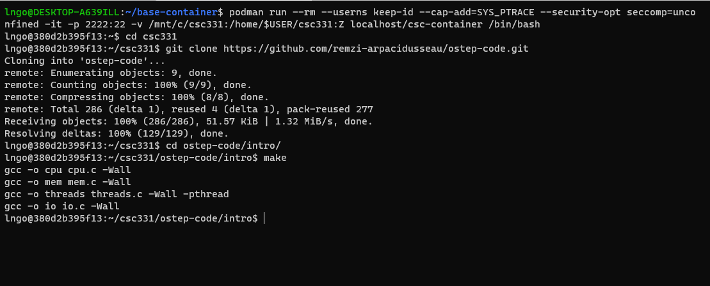
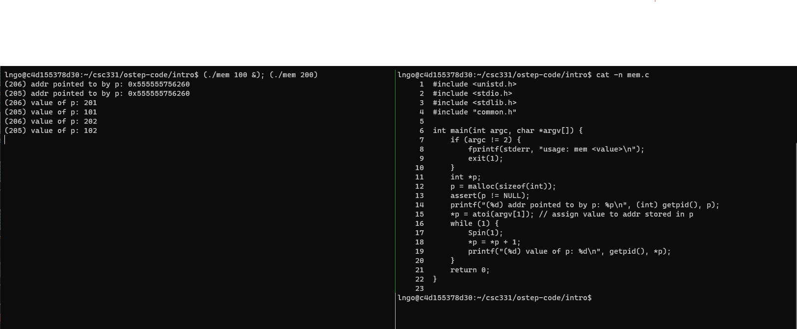

> ## 1. What happens when a computer program run?     
>  
>  The process
>    - **fetches** an instruction from memory,
>    - **decodes** the instruction, and
>    - **executes** the instruction.
>  This is the fundamental **Von Neumann** model of computing. 
>
{: .slide}

> ## 2. Why do we need OS?
> 
> 
>  - What a programmer see is all code, lines of codes.
>  - Underneath, there is a complex ecosystem of hardware components. 
>  - How do we hide this complexity away from the programmers?
> 
{: .slide}

> ## 3. How do the OS help (1)?
>
>  This is possible due to **virtualization**.
>  - Virtualization: presents general, powerful, and easy-to-use **virtual** forms of 
>  **physical** computing resources to users (*programmers*). 
>  - The linkage between virtual interfaces and physical components are enabled through
>  the OS' **system calls** (or **standard library**).  
>
{: .slide}

> ## 4. How do the OS help (2)?
>
>  - Each physical component in a computing system is considered a resource. 
>  - The OS **manages** these resources so that multiple programs can access
>  these resources (through the corresponding virtual interface) at the same time.  
>  - This is called **concurrency**. 
{: .slide}

> ## 5. Hands-on: Getting started
>
> - Open a terminal (Windows Terminal or Mac Terminal). 
> - Run the command to launch the image container for your platform:
> - Windows:
> 
> ~~~
> $ podman run --rm --userns keep-id --cap-add=SYS_PTRACE --security-opt seccomp=unconfined -it -p 2222:22 -v /mnt/c/csc331:/home/$USER/csc331:Z localhost/csc-container /bin/bash
> ~~~
> {: .language-bash}
>
> - Mac:
>
> ~~~
> $ docker run --rm --userns=host --cap-add=SYS_PTRACE --security-opt seccomp=unconfined -it -p 2222:22 -v /Users/$USER/csc331:/home/$USER/csc331:Z csc-container /bin/bash
> ~~~
> {: .language-bash}
>
> - Navigate to `/home/$USER/csc331`
> - Clone the scripts [Dr. Arpaci-Dusseau's Git repo](https://github.com/remzi-arpacidusseau/ostep-code).
> - Change to directory `ostep-code/intro`, then run `make` to build the programs. 
>
> ~~~
> $ git clone https://github.com/remzi-arpacidusseau/ostep-code.git
> $ cd ostep-code/intro
> $ make
> ~~~
> {: .language-bash}
>
> 
> 
{: .slide}

> ## 6. Hands-on: CPU Virtualization 
> 
> - Our workspace is limited within the scope of a single terminal (a single shell) 
> to interact with the operating system. 
> - `tmux`: *terminal multiplexer*. 
> - `tmux` allows user to open multiple terminals and organize split-views (panes) 
> within these terminals within a single original terminal. 
> - We can run/keep track off multiple programs within a single terminal. 
>
> ~~~
> $ cd ~/csc331/ostep-code/intro
> $ tmux
> ~~~
> {: .language-bash}
>
> - Splits the `tmux` terminal into vertical panes: first press the keys `Ctrl-b` then lift your fingers and press
> the keys `Shift-5` (technical documents > often write this as `Ctrl-b` and `%`).
>
> 
>
> - You can use `Ctrl-b` then the `left` and `right` arrows to move the active cursors between 
> the two panes. 
> - Move the cursor to the right channel and run the following commands to view the source code 
> of `cpu.c`.
> - Also run `nproc` in the right pane to figure out how many CPUs your container has access to. 
>
> ~~~
> $ cat -n cpu.c
> $ nproc
> ~~~
> {: .language-bash} 
>
> - Run the following command on the **left pane** to execute `cpu` program accordingly. 
>   - *Reminder: use `Ctrl-b` then the `left` and `right` arrows to move the active cursors 
>   between the two panes.* 
> - In my case, I have 8 cores, so my commands will be extended for two more. 
>
> ~~~
> $ (./cpu A &); (./cpu B &); (./cpu C &); (./cpu D &); (./cpu E &); (./cpu F &); (./cpu G &); (./cpu H &); (./cpu I)
> ~~~
> {: .language-bash}
>
> 
>
> - To stop the running processes on the left pane, move to the right pane and running the
> following commands:
>
> ~~~
> $ ps aux | grep cpu
> ~~~
> {: .language-bash}
> 
> - Identify the process ID (the second columns), then use the `kill` to kill all the process IDs 
> (see figure below). 
>
> 
>
{: .slide}

> ## 7. The illusion of infinite CPU resources
>
> - A limited number of physical CPUs can still be represented as infnite number of CPUs through 
> **virtualization**.  
> - The OS will **manage** the scheduling and allocation of the actual run on physical resources. 
> 
{: .callout}

> ## 8. Hands-on: Memory Virtualization
> 
> - Type `exit` and hit `Enter` once to close one pane. 
> - Type `exit` and hit `Enter` again to close tmux.  
> - Run the following commands:
> 
> ~~~
> $ setarch `uname -m` -R /bin/bash
> $ tmux
> ~~~
> {: .language-bash}
> 
> - Press `Ctrl-b` and then `Shift-%` to split the tmux screen into two 
> vertical panes again. 
> - In the right pane, run the following command:
> 
> ~~~
> $ cat -n mem.c
> ~~~
> {: .language-bash}
> 
> - In the left pane, run the following command:
>
> ~~~
> $ (./mem 100 &); (./mem 200)
> ~~~
> {: .language-bash}
>
> - When finished, kill the two memory processes using the `kill` command and the process ID 
> shown in the parentheses. You should switch to the right pane for this task. 
> 
> 
>
{: .slide}

> ## 9. Do programs running concurrently occupy the same memory locations (addresses)?
>
> > ## Answer     
> >  - No
> >
> {: .solution}
{: .challenge}

> ## The illusion of dedicated memory resources
>
> - Many running program share the physical memory space. 
> - Each runnning program is presented with the illusion that they have access to their own private
> memory. This is called **virtual address space**, which is mapped to physical memory space
> by the OS.  
> - Making memory references within one running program (within one's own virtual address space) 
> does not affect the private virtual address space of others. 
> - Without **setarch `uname -m` -R /bin/bash**, the location of variable `p` will be 
> randomize within the virtual address space of a process. This is a security mechanism to 
> prevent others from guessing and applying direct manipulation techniques to the physical 
> memory location that acually contains `p`. 
>
{: .callout}

> ## Hands-on 8: Memory Virtualization
> 
> - Go to the bash terminal where you executed the command to kill the running `cpu` processes
> and repeat the procedure, this time to kill the running `mem` processes:
>
> 
>
{: .slide}

> ## Concurrency
> 
> - As shown in **CPU Virtualization** and **Memory Virtualization** examples, the OS 
> wants to manage many running programs at the same time.
> - This is called **concurrency**, and it leads to a number of interesting challenges 
> in designing and implementing various management mechanisms within the OS.
>
{: .slide}

> ## Hands-on 9: Concurrency
>
> - Navigate to `ostep-code/intro`
> - Click on `threads.c` to view the file. 
> - *VSCode will recommend a C/C++ extension for this file type. You can select to 
> install them or not*. 
>
> 
>
{:.slide}

> ## Hands-on 10: Concurrency
>
> - `threads.c` creates two functions running at the same time, within the same memory 
> space of the  main program.
> - A single global variable named counter is being increased by both functions, thus 
> the final value of counter should be twice that of the command line argument.
> - Compile and run this program several time with different values.
>
> ~~~
> $ sudo sysctl -w kernel.randomize_va_space=0
> $ gcc -Wall -pthread -o threads threads.c
> $ ./threads 200
> $ ./threads 400
> $ ./threads 600
> $ ./threads 800
> $ ./threads 1000
> ~~~
> {: .language-bash}
> 
> 
>
{: .slide}

> ## Hands-on 11: Concurrency
>
> - We need to change the VM so that it uses 2 CPU. To do that, run the following in the terminal:
> ~~~
> $ sudo shutdown now
> ~~~
> {: .language-bash}
>
> - The VM is powered-off in VirtualBox, and VSCode lost connection. 
>
> 
>
{: .slide}

> ## Hands-on 12: Concurrency
>
> - Go to VirtualBox, select the csc331 image, go to **Settings**/**System**/**Processor** and
> change the number of Processor(s) to `2`
> - Restart the VM in headless mode again afterward. 
> 
> 
>
{: .slide}

> ## Hands-on 13: Concurrency
>
> - Reconnect VSCode to the VM. 
> - Rerun the `threads` program:
> 
> ~~~
> $ sudo sysctl -w kernel.randomize_va_space=0
> $ cd ostep-code/intro
> $ ./threads 200
> $ ./threads 400
> $ ./threads 600
> $ ./threads 800
> $ ./threads 1000
> $ ./threads 10000
> $ ./threads 20000
> $ ./threads 50000
> $ ./threads 60000
> $ ./threads 80000
> ~~~
> {: .language-bash}
>
> 
>
{: .slide}

> ## Observation
>
> - Naive concurrency gives you wrong results.  
> - Naive concurrency gives you wrong and inconsistent results. 
> 
{: .callout}

> ## Why does this happen?
>
>  - At machine level, incrementing counter involves three steps:
>    - Load value of counter from memory into register,
>    - Increment this value in the register, and
>    - Write the value of counter back to memory.
>  - What should have happened:
>    - One thread increments counter (all three steps), then the other thread increments
>    counter, now with the updated value.
>  - What really happened:
>    - One thread increments counter.
>    - While this thread has not done with all three steps, the other thread 
>    steps in and attempts to increment the stale content of counter in memory.
>
{: .slide}

# Persistency

> ## Observation
>
> - When the programs stop, everything in memory goes away: counter, p, str.
> - Physical components to store information persistently are needed.
> - Input/output or I/O devices:
>   - Hard drives
>   - Solid-state drives
> - Software managing these storage devices is called the file system.
> - Examples of system calls/standard libraries supporting the file system:
>   - open()
>   - write()
>   - close()
>
{: .callout}

# A brief history of operating system research and development

A good paper to read: [Hanser, Per Brinch. "The evolution of oeprating systems" 2001](http://citeseerx.ist.psu.edu/viewdoc/download?doi=10.1.1.104.1524&rep=rep1&type=pdf)

> ## Early operating systems: just libraries
>
> - Include only library for commonly used functions.
> - One program runs at a time.
> - Manual loading of programs by human operator.
>
{: .slide}

> ## Beyond libraries: protection
>
> - System calls
> - Hardware privilege level
> - User mode/kernel mode
> - **trap**: the initiation of a system call to raise privilege from user mode to kernel mode. 
>
{: .slide}

> ## The era of multiprogramming
>
> - Minicomputer
> - **multiprogramming**: multiple programs being run with the OS switching among them. 
> - Memory protection
> - Concurrency
>
{: .slide}

> ## The modern era
>
> - Personal computer
> - DOS: the Disk Operating System
> - Mac OS
> - Multics (MIT) -> UNIX (Bell Labs) -> BSD (Berkeley) -> Sun OS/Linux
>
{: .slide}


