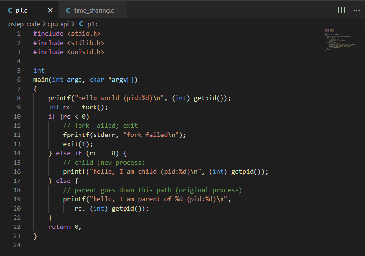
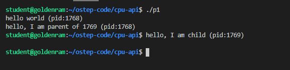

> ## Process API
>
> Include three function calls:
> - fork()
> - exec()  
> - wait()  
{: .slide}

> ## fork()
>
> - ... is a system call. 
> - ... is used to create a new process.   
> - Documentation: [https://www.man7.org/linux/man-pages/man2/fork.2.html]    
> - Some important points:
>   - fork() creates a new process by duplicating the calling process. 
>   The new process is referred to as the child process.  The calling proces
>   is referred to as the parent process.
>   - The child process and the parent process run in separate memory
>   spaces.  **At the time of fork() both memory spaces have the same 
>   content**.  
>   - The child process is an exact duplicate of the parent process except
>   for the following points:
>     - The child has its own unique process ID, and this PID does not 
>     match the ID of any existing process group (setpgid(2)) or session.
>     - The child's parent process ID is the same as the parent's process
>     ID.
>     - The child does not inherit outstanding asynchronous I/O operations
>     from its parent (aio_read(3), aio_write(3)), nor does it inherit 
>     any asynchronous I/O contexts from its parent (see io_setup(2)).
>     - The child inherits copies of the parent's set of open file 
>     descriptors.  Each file descriptor in the child refers to the same 
>     open file description (see open(2)) as the corresponding file 
>     descriptor in the parent.  This means that the two file 
>     descriptors share open file status flags, file offset, and 
>     signal-driven I/O attributes.
{: .slide}

> ## Hands-on 1: Getting started
>
> - Start the csc331 VM in headless mode. 
> - Connect VSCode to csc331. 
> - Open a terminal
> 
{: .slide}

> ## Hands-on 2: process creation using fork() 
> 
> - Navigate to `ostep-code/cpu-api`
> - Click on `p1.c` to view the file. 
> - *VSCode will recommend a C/C++ extension for this file type. You can select to install them or not*. 
> 
>
> - Line 5-6: No idea why the author sets up the source code that way ...
> - Line 8: prints out hello world and the process identifier (pid) of the current process.
> - Line 9: calls `fork()`, which initiate the creation of a new process. The return of this fuction 
> call is assigned to variable `rc`. 
> - Line 10: If `rc` is negative, the function call failed and the program exits with return value 1. 
> This line is evaluated within the parent process (since the child process creation failed).
> - Line 14: If `rc` is non-negative
>   - The `fork` call is successful, and you now have **two** process. 
>     - The new process is an almost exact copy of the calling process.
>     - The new process does not start at `main()`, but begins immediately after `fork()`.
>   - The value of `rc` differs in each process. 
>     - The value of `rc` in the new process is `0`. 
>     - The value of `rc` in the parent process is non-zero and actually is the `pid` of the new process. 
> - Line 16 and line 19 confirms the above point by having the child process prints out its own 
> process ID and the parent process prints out the `rc` value. These two values should be the same. 
{: .slide}

> ## Hands-on 3: compile and run p1.c 
> 
> - In the terminal, navigate to `ostep-code/cpu-api` using `cd`
>   - Review hands-on from previous lessons on how. 
> - Compile and run `p1.c`.  
> - *You will need to hit Enter to get a new clean prompt. Why?*. 
> 
{: .slide}



