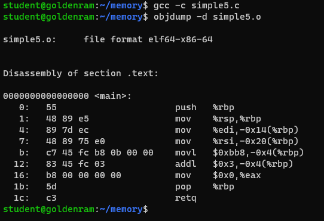
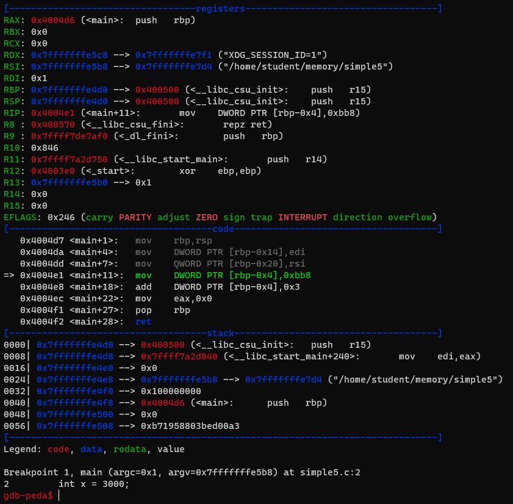
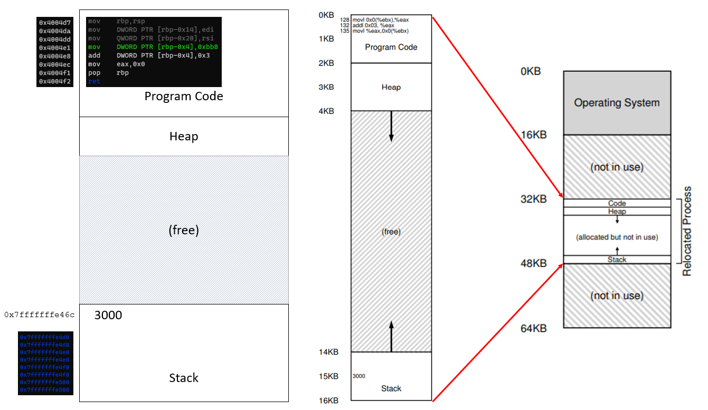
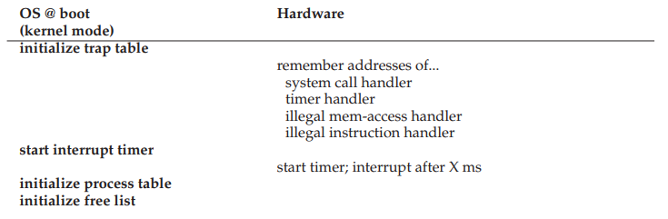
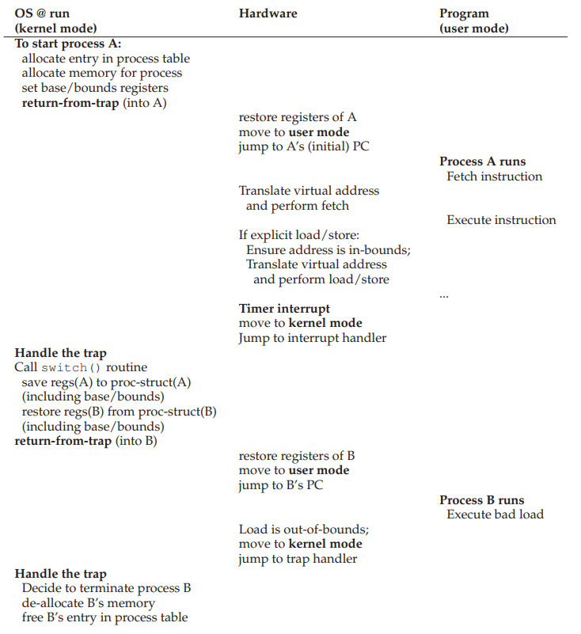
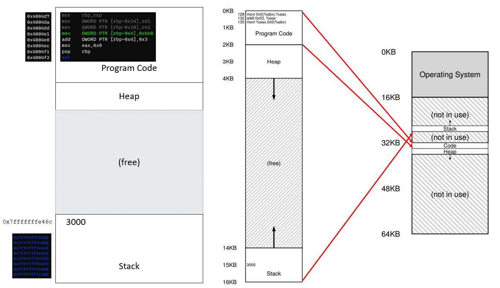

> ## 1. The questions?
> 
> - How can we build an efficient virtualization of memory?
> - How do we provide the flexibility needed by applications?
> - How do we maintain control over which memory locations an 
> application can access?
>
{: .slide}

> ## 2. General technique
> 
> - Hardware-based address translation (address translation)
>   - HW transforms **virtual address** from memory access into **physical address**. 
> - The OS gets involved to ensure correct translations take place and manage memory 
> to keep track of and maintain control over free and used memory locations.
>
{: .slide}

> ## 3. Initial assumptions
> 
> - User’s address space must be place **contiguously in physical memory**.
> - The size of the address space is **less than the size of physical memory**. 
> - Each address space is **exactly the same size**.
>
{: .slide}

> ## 4. Hands on: revisiting where things are in memory
> 
> - Launch your `csc331` VM. 
> - Connect to `csc331` from a terminal using the following command:
> `ssh -p 2222 student@127.0.0.1`. Password: `goldenram`. 
> - Change into `memory` directory. 
> - Create a file named `simple5.c` with the following contents:
>
> 
>
> - Compile and view `simple5.c` object file
>
> ~~~
> $ gcc -c simple5.c
> $ objdump -d simple5.o
> ~~~
> {: .language-bash}
>
> 
>
> - What is the decimal value of `0xbb8`?
> - Compile with `-g` for `simple5.c`. 
> - Execute `gdb simple5`, set breakpoint at `main`, and start running. 
>
> 
>
> - Where is the variable `x` is? (run `p &x` to find out)
> - What is the difference between the value contained in `%ebp` and the address of `x`?
> - Where is the machine instruction? (code)
> - Where are their location in address space?
>
{: .slide}

> ## 5. Initial assumptions
> 
> - User’s address space must be place **contiguously in physical memory**.
> - The size of the address space is **less than the size of physical memory**. 
> - Each address space is **exactly the same size**.
>
> 
>
{: .slide}

> ## 6. Early attempt: dynamic relocation
> 
> - Hardware-based
> - Aka base and bounds
> - Two hw registers within each CPU:
>   - Base register
>   - Bounds (Limit) register
>
> ~~~
> physical address = virtual address + base
> 0 <= virtual address <= bound
> ~~~
>
{: .slide}

> ## 7. Dynamic relocation: after boot
> 
> 
>
{: .slide}

> ## 8. Dynamic relocation: during process run
> 
> 
>
{: .slide}

> ## 9. Dynamic relocation: Summary
> 
> - Pros:
>   - Highly efficient through simple translation mechanisms
>   - Provides protection
> - Cons:
>   - Wastage through **internal fragmentation** due to space inside
>   the allocated (contiguous) memory units are not fully utilized. 
>
{: .slide}

> ## 10. Initial assumptions
> 
> - ~~~User’s address space must be place **contiguously in physical memory**.~~~
> - ~~~The size of the address space is **less than the size of physical memory**.~~~ 
> - ~~~Each address space is **exactly the same size**.~~~
>
> *How do we support a large address space with (potentially) a lot of free space
> between the stack and the heap?*
{: .slide}

> ## 11. Segmentation: generalized base/bounds
> 
> - Original: One base/bound pair for one address space.
> - Segmentation: One base/bound pair per logical segment of an address space:
>   - Code
>   - Stack
>   - Heap
>
{: .slide}

> ## 12. Segmentation: generalized base/bounds
> 
> 
>
{: .slide}



