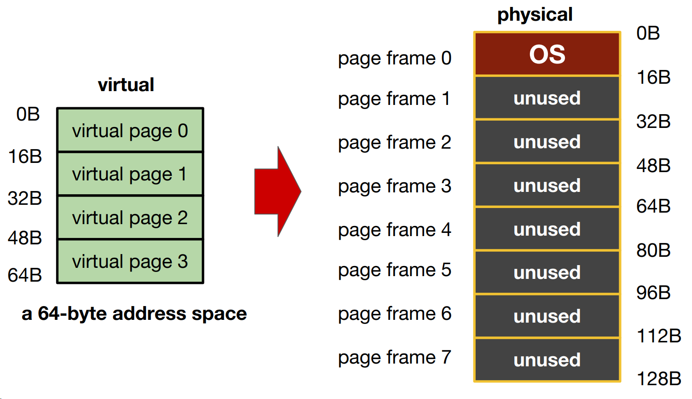
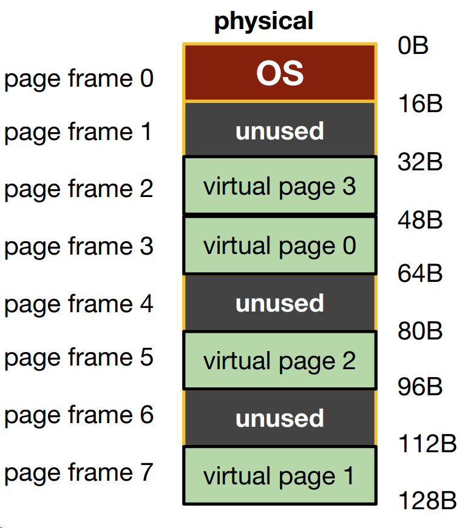
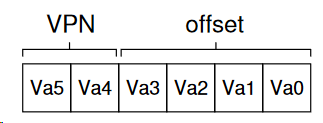
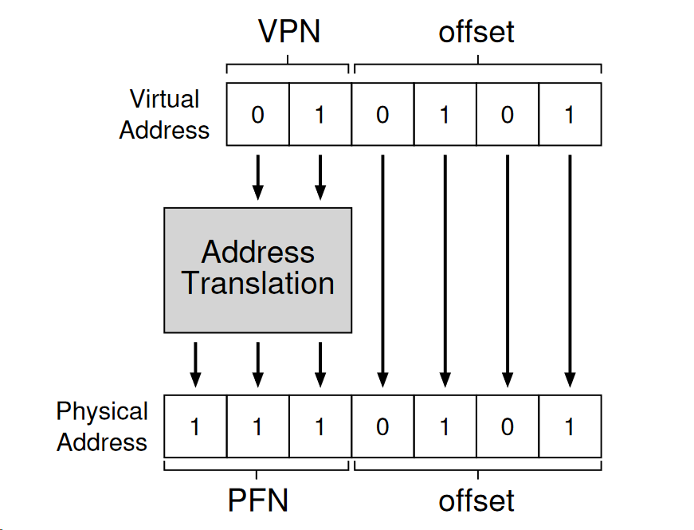
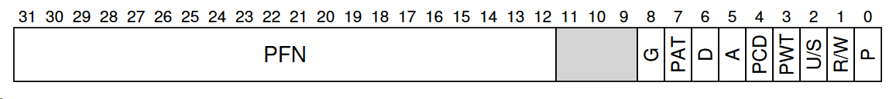
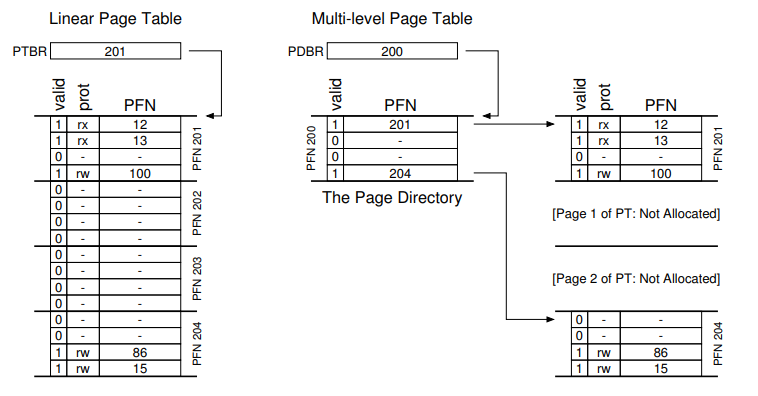

FIXME

> ## 1. What is paging?
> 
> - Divide contents into fixed-size units, called pages.
>   - Each page has a page number
>   - Locate contents in pages by an offset (10th word on page 185)
>   - There is a table to tell you which content is on which page
> - Physical memory is viewed as an array of fixed-size slots called page frames.
>   - Each frame can contain a single virtual memory page
>
> 
{: .slide}

> ## 2. After allocation
> 
> - For allocation management, the OS keeps a list of free (fixed-size) pages.
>   - This is much simpler than trying to maintain a list of variable-size memory regions
> - Virtual pages are numbered, which preserve the order of the virtual address space. 
> This allows us to allocate page frame for the virtual pages across the entire available 
> physical memory space. 
>
> 
{: .slide}

> ## 3. What data structure is needed?
> 
> - Page Table: Mapping from virtual page number to physical page frame
>   - VP0 -> PF3
>   - VP1 -> PF7
>   - VP2 -> PF5
>   - VP3 -> PF2
> - Each process has its own page table
>
> 
{: .slide}

> ## 4. Address translation with paging. 
> 
> - To translate a virtual address, we need:
>   - Virtual page number (VPN)
>   - The offset within the page
>
> 
>
> - For the 64-bit virtual address space, 6 bytes are needed (26 = 64)
>   - There are four pages (2 bytes for VPN)
>   - Each page stores 16 bytes (4 bytes to describe offset of these 16 bytes). 
>
> 
>
> - The physical memory has 128 bit, so the physical address will be 7 bytes. 
>   - The 2-byte VPN (virtual page number) will be translated to a corresponding 
>   3-byte PFN (page frame number). 
>   - The offset remains the same (virtual page has the same size as page frame). 
>
> 
{: .slide}

> ## 5. New questions!
> 
> - What are the typical contents of the page table?
> - How big are the page tables?
> - Where are the page tables stored?
> - Does paging slow down the system?
>
{: .slide}

> ## 6. Contents of a page table entry (PTE) for 32-bit x86
> 
> - `PFN`: 20 bits for physical page frame number (page size 4K)
> - `P`: present bit, whether this page is on memory or on disk (swapped)
> - `R/W`: read/write bit, whether writes are allowed to this page
> - `U/S`: user/supervisor bit, whether user-mode processes can access this page
> - `A`: access bit, whether this page has been accessed
> - `D`: dirty bit, whether this page has been modified
> - `PWT, PCD, PAT, G`: [how hardware caching works for this page](https://xem.github.io/minix86/manual/intel-x86-and-64-manual-vol3/o_fe12b1e2a880e0ce-425.html)
>
> 
{: .slide}

> ## 7. Size of page table 32-bit x86
> 
> - Typical page size is 4KB (run `getconf PAGESIZE` in your VM to observe this)
> - Size of address space: 4GB
> - Number of pages in address space: 4GB / 4KB = 1M
> - Number of PTE in page table: 1M
> - How many bits for VPN: 20
> - How many bits for offset: 12
> - Each PTE is 4 bytes, therefore the size of a page table is 4B * 1M = 4MB per process
> - Assume 100 processes running, we have 400MB of all page tables 
> - **This is too big**
{: .slide}

> ## 8. How can we reduce the size of the page table?
> 
> - Bigger pages. 
> - Hybrid: Page + Base/Bound
> - Multi-level page tables
{: .slide}

> ## 9. Bigger pages
> 
> - Let the page size be 16K instead of 4K
>   - 4GB address space
>   - Number of pages in address space: 4GB / 16KB = 256K
>   - Number of PTE in page table: 256K
>   - How many bits for VPN: 18
>   - How many bits for offset: 14
>   - Each PTE is 4 bytes in size
>   - Total size of page table is 256K * 4B= 1M
> - Smaller by a factor of 4
> - Problem:
>   - For small processes, we waste the remaining space of a page.
>   - This is internal fragmentation
{: .slide}

> ## 10. Hybrid
> 
> - Separate page tables for stack, heap, and code.
> - For each page table, use base/bound register to keep the physical address 
> of the page table.
> - Use two bits in the virtual address to indicate which segment it is in.
> - No need to have PTEs for unused paged.
> - Problem: Bring back all issues of segmentation
>   - Free space management
>   - External fragmentation
{: .slide}

> ## 11. Multi-level page tables
> 
> - Overall idea
>   - Chop up the page table into page-sized units.
>   - If an entire page of page-table entries is invalid, don’t allocate that page 
>   of the page table at all (reduce memory space).
> - A new structure called **page directory** is needed to keep track of pages' validity
{: .slide}

> ## 12. Multi-level page tables
> 
> - Two-level table
> - One entry per page of page table (Page Directory Entry - PDE)
> - A PDE has a valid bit and a page frame number (PFN)
> - If the PDE is valid, it means that at least one of the the pages of the page table that 
> the entry points to (via the PFN) is valid. 
> - If the PDE is not valid, the rest of the PDE is not defined. 
>
> 
{: .slide}

> ## 13. Multi-level page tables: advantages
> 
> - Only allocates page-table space in proportion to the amount of address 
> spaces being used.
> - If carefully constructed, each portion of the page table fits neatly within 
> the page, making it easier to manage memory (think pointer to memory space versus 
> contiguous memory location).
>
{: .slide}

> ## 13. Multi-level page tables: cost
> 
> - `Space` versus `Time`: To reduce space, increased access translation steps are needed: 
> one for the page directory and one for the PTE itself. 
> - Complexity: Page table lookup is more complex to implement than a simple linear 
> page-table look up. 
>
{: .slide}



