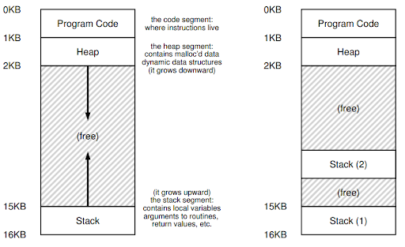
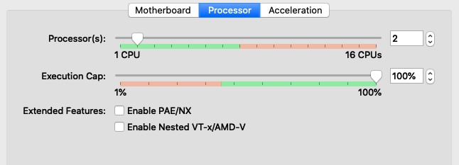
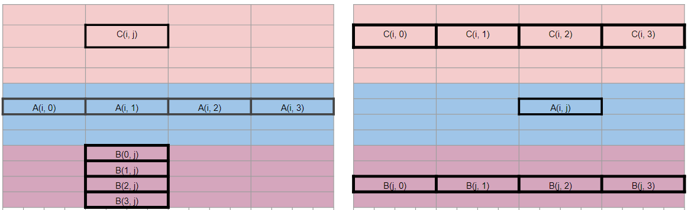

> ## 1. Review: process calls fork()
> 
> - New PCB (process control block) and address space.
> - New address space is a copy of the entire contents of the parent's 
> address space (up to fork).
> - Resources (file pointers) that point to parent’s resources.
> - **In general, time consuming.**
>
{: .slide}

> ## 2. Review: process context switch
> 
> - Save A's registers to A's kernel stack.
> - Save A's registers to A's PCB.
> - Restore B's registers from B's PCB.
> - Switch to B's kernel stack.
> - Restore B's registers from B's kernel stack.
> - **In general, time consuming.**
>
{: .slide}

> ## 3. Example: web server
> 
> - A process listens to requests.
> - When a new request comes in, a child process is created to 
> handle this request.
> - Multiple requests can be handled at the same time by 
> different child processes.
> - What is the problem?
>
> ~~~
> while (1) {
>	  int sock = accept();
>   if (0 == fork()) {
>     handle_request();
>     close(sock);
>     exit(0);
>   }
> }
> ~~~
> {: .language-c}
>
{: .slide}

> ## 4. Thread: a new abstraction for running processes
> 
> - A normal process is a running program with a single point of execution, 
> i.e, a single PC (program counter).
> - A **multi-threaded** program has **multiple points of execution**, i.e., multiple PCs.
> - Each thread is very much like a separate process, except for one difference:
>   - All threads of the same process share the same address space and thus can 
>   access the same data. 
>
> 
{: .slide}

> ## 5. Thread: state of a single thread
> 
> - Each thread has its own PC.
> - Each thread has its own private set of registers for computation.
> - Context switching is still needed. 
> - Threads use Thread Control Blocks (TCP) to store their execution states.
> - Context switching is similar to that of processes, except for:
>   - Thread context-switching keep the same address space (i.e., no need to switch out the page table).
>
{: .slide}

> ## 6. Example: web server using thread
> 
> ~~~
> int global_counter = 0;
> web_server() {
>   while (1) {
>     int sock = accept();
>     thread_create(handle_request, sock);
>   }
> }
>
> handle_request(int sock) {
>   process request;
>   ++global_counter;
>   close(sock);
> }
> ~~~
> {: .language-c}
>
{: .slide}

> ## 7. API: POSIX threads (pthreads)
> 
> - Standardized C language thread programming API.
> - `pthreads` specifies the interface of using threads, but not how threads 
> are implemented in OS.
> - Different implementations include: 
>   - kernel-level threads,
>   - user-level threads, or 
>   - hybrid
>
{: .slide}

> ## 31. Hands on: matrix multiplication
>
> - Before turning on the VM, makes sure that you have two processors assigned
> to your VM. 
>
> 
>
> - SSH into `csc331` VM (command: `ssh -p 2222 student@127.0.0.1` password: `goldenram`).
> - **Reminder**: The sequence to create/edit files using `nano` is as follows:
>   - Run `nano -c file_name`
>   - Type in the contents
>   - When done, press `Ctrl-X`
>   - Press `y` to confirm that you want to save modification
>   - Press `Enter` to confirm the file name to save to. 
> - Launch a tmux session with two vertical panels.  
> - Create two vertical panels. 
> - In the left panel, create a directory named `concurrency`, 
> change to this directory, and create `thread_hello.c` with 
> the following contents:
>
> 
>
> 
{: .slide}



