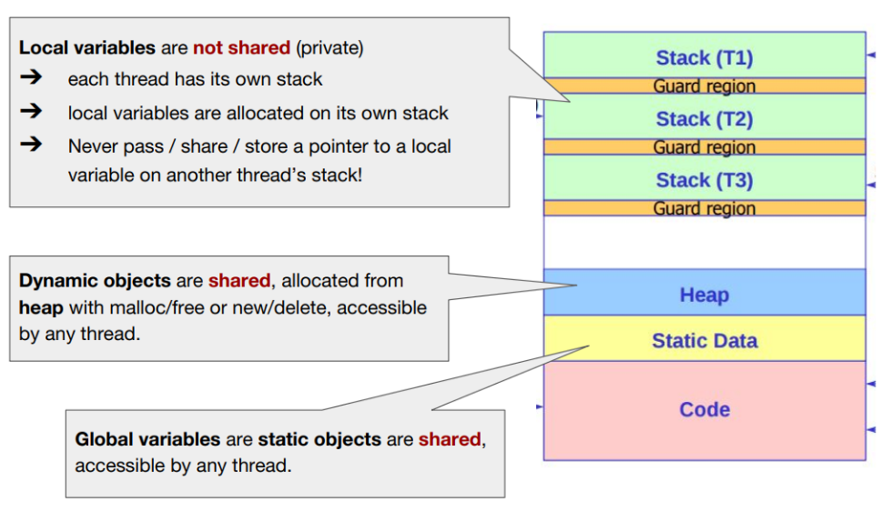
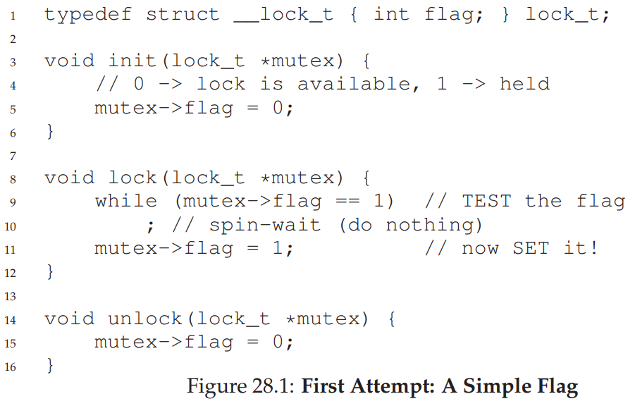

> ## 1. Recall the problem from intro-to-os
> 
> 
> 
>
> 
>
> - Two concurrent threads manipulated a shared resource (the counter variable) 
> without any synchronization.
>   - Outcome depends on the order in which accesses take place -- this is called a 
>   **race condition**.
> - We need to ensure that only one thread at a time can manipulate the shared resource so 
> that we can reason about program behavior, in a sane way 
>   - We need **synchronization**.
>
{: .slide}

> ## 2. What is shared/not shared in a multithreaded program?
> 
> 
>
{: .slide}

> ## 3. Key definitions
> 
> - A **critical section** (CS) is a segment of code that accesses a shared resource, 
> usually a variable or data structure.
> - A **race condition** (**data race**) arises if multiple threads of execution enter 
> the critical section at roughly the same time; both attempt to update the shared data 
> structure, leading to a surprising and undesirable outcome. 
> - An **indeterminate** program consists of one or more race conditions. The outcome 
> is thus not deterministic. 
> - To avoid these problem, threads should use some kind of mutual exclusion primitives. 
> Doing so guarantees that only a single thread ever enters a critical section, thus 
> avoiding races and resulting in deterministic program outputs.
>
{: .slide}

> ## 4. Requirements for Critical Section Handling
> 
> - `Mutual Exclusion`: if one thread is in the CS, then no other is
> - `Progress`: threads waiting for access to CS are not prevented from entering by 
> threads not in the CS; threads do not wait indefinitely.
> - `Bounded Waiting` (no starvation): all waiting threads are guaranteed to eventually 
> get access to the CS.
> - `Performance`: The overhead of entering and exiting the CS is small compared to the work 
> done within it.
>
{: .slide}

> ## 5. Lock: Definition
> 
> - `Atomic instruction`: A machine instruction that can be executed in a single clock cycle. 
> - Programmers annotate source code with **locks** around a critical section, ensuring that it 
> behaves like a single atomic instruction. 
> - What is a **lock**?
>   - Is declared as a lock variable. 
>   - The lock variable holds the state of the lock. 
>   - The states are either:
>     - Available (unlocked or free): No thread holds the lock
>     - Acquired (locked or held): Exactly one thread holds the lock and presumably is in a 
>     critical section.
>   - The lock variable can also hold additional information (often hidden from users):
>     - Which thread is holding the lock
>     - A queue for ordering lock acquisition
>     ...
{: .slide}

> ## 6. Semantic of locking: lock() and unlock()
> 
> - A thread calls `lock()` when it tries to acquire the lock:
>   - If no other thread is holding the lock, the thread will acquire the lock and enter the 
>   critical section (becomes owner of the lock).
>   - If another thread is holding the lock, the call will not return. 
> - Once the lock owner is finished, it calls unlock() and the lock becomes available. 
>   - If there is no waiting thread, the lock becomes free.
>   - If there are some waiting threads, one of them will acquire the lock and enter the critical 
>   section. 
> - Lock in `pthread`: https://linux.die.net/man/3/pthread_mutex_lock 
{: .slide}

> ## 7. How do we build a lock?
> 
> - How do we build an efficient lock?
> - What hardware support is needed?
> - What OS support is needed? 
{: .slide}

> ## 8. Criteria of a good lock
> 
> - Mutual exclusion
> - Fairness
> - Performance
{: .slide}

> ## 9. First attempt: controlling interrupts
> 
> - One of the earliest solutions for single processor systems. 
>   - `lock()` will disable interrupts. 
>   - `unlock()` will enable interrupts. 
> - Advantages
>   - Simplicity
> - Disadvantages
>   - Allow user programs to perform privileged operations
>   - Disable interrupts carries significant implication in preventing OS from 
>   performing interventions. 
>   - Do not work on multi-processors (since another thread can still enter the 
>   critical section via different computing core).
>   - Prevent non-locking interrupts to take place. For example, disk I/O interrupts.
>   - Inefficient. It is difficult to implement code that mask/unmask interrupts. 
{: .slide}

> ## 10. We need CPU hardware support
> 
> - Simple principle: Load and Store a **lock** flag
> - Correctness: 
>   - Interrupts can still lead to inconsistency issues
> - Performance:
>   - The waiting threads need to keep checking the condition of the flag (spin-waiting)
>
> 
{: .slide}

> ## 11. Spin lock with Test-and-Set
> 
> - Hardware support for locking begins in early 1960.
> - TestAndSet can be performed atomically by hardware.
>
> 
> 
{: .slide}

> ## 12. Spin lock with Test-and-Set: how does it work?
> 
> - Lock is free:
>   - flag is 0
>   - TestAndSet returns the old value of flag (break the loop) but also set 
>   the value of the flag (acquire the lock).
> - Lock is not free:
>   - flag is 1 
>   - TestAndSet keeps setting the lock but also spinning inside the while loop until the 
>   lock is released. 
>
> 
{: .slide}

> ## 13. Evaluating the basic spin lock
> 
> - Correctness: Yes
> - Fairness: No - can lead to starvation
> - Performance: 
>   - TestAndSet requires CPU cycle (even as an atomic operation)
{: .slide}



