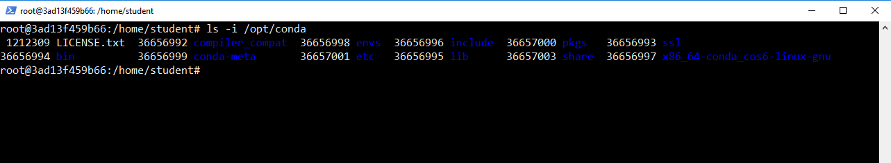
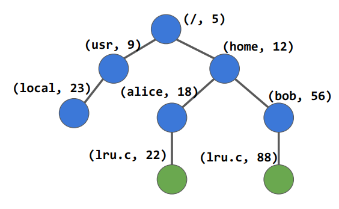

> ## 1. File systems
>
> - Provide long-term information storage
> - Challenges:
>   - Store very large amounts of information
>   - Multiple processes must be able to access ino concurrently
>   - Information must survive (persist)
>     - termination of process using it
>     - computer crashes
>     - disk failures
>     - power outage
>     - …
>   - Easy-to-use user interface
{: .slide}

> ## 2. Files and directories
>
> - It’s all illusion!
> - CPU virtualization: a **process** that has its own processor.
> - Memory virtualization: a big, contiguous, and private address space that 
> can easily be accessed through virtual addresses. 
> - Storage virtualization: a huge, persistent storage with files and directories 
> which can be accessed using some easy-to-use APIs (ls, rm, cp …).
{: .slide}

> ## 3. Abstraction: files and directories
>
> - File: a linear array of bytes, each of which you can read and write.
> - A file has some high-level, user-readable name, e.g., `interceptor.c`.
>   - One file may have multiple user-readable names, as we will see.
> - Each file has a low-level name called the `inode` number.
>   - This is the real identifier of a file.
> - File system does NOT care about what type of file it is (C code, picture 
> or video, it just makes sure to store all bytes in a file **persistently**.
>
> 
{: .slide}

> ## 4. Abstraction: files and directories
>
> - Directory
>   - Each directory also has an `inode` number
> - Content of a directory:
>   - a list of (user-readable name, `inode` number) pairs
>   - which are the files and directories *under* this directory
> - Directory tree / hierarchy
>
> 
{: .slide}

> ## 5. File operations: create
>
> `int fd = open(“foo”, O_CREAT | O_WRONLY | O_TRUNC, S_IRUSR | S_IWUSR)`
> - [open](http://man7.org/linux/man-pages/man2/open.2.html)
> - `O_CREAT`: creates the file if it does not exist.
> - `O_WRONLY`: the file can only be written to.
> - `O_TRUNC`: if the file already exists, truncates it to zero bytes, removing 
> any existing contents. 
> - `S_IRUSR`: readable by the owner,
> - `S_IWUSR`: writable by the owner.
> - `fd`: file descriptor, starts at 3. 
>   - `0`: stdin
>   - `1`: stdout
>   - `2`: stderr
{: .slide}

> ## 6. Hands on: privilege escalation
>
> `int fd = open(“foo”, O_CREAT | O_WRONLY | O_TRUNC, S_IRUSR | S_IWUSR)`
> - [open](http://man7.org/linux/man-pages/man2/open.2.html)
> - `O_CREAT`: creates the file if it does not exist.
> - `O_WRONLY`: the file can only be written to.
> - `O_TRUNC`: if the file already exists, truncates it to zero bytes, removing 
> any existing contents. 
> - `S_IRUSR`: readable by the owner,
> - `S_IWUSR`: writable by the owner.
> - `fd`: file descriptor, starts at 3. 
>   - `0`: stdin
>   - `1`: stdout
>   - `2`: stderr
{: .slide}



