> ## 1. What is C?     
>  
> - Developed by Dennis Ritchie at Bell Labs
> - First public released in 1972. 
> - **The** book: *The C programming languange" by Dennis M. Ritchie and Brian W. Kernighan. 
> Prentice Hall 1988. 
{: .slide}

> ## 2. How to learn C (now that you already know Java)?     
>  
> - [C for Java programmers][c4java]
> - [C programming vs. Java programming][c_vs_java]
{: .slide}

> ## 3. Scary stuff ahead ...     
>  
> - C is much less supportive for programmers than Java.
> - (Much) easier to make mistake, and (much) harder to fix. 
{: .slide}

> ## 4. But it is exciting ...     
>  
> - C requires less memory resources than Java.
> - C, in many instances, runs faster than Java. 
> - Knowing C will make you a better programmer overall. 
{: .slide}

> ## 5. Similarities (or mostly similar) between C and Java     
>  
> - Values, types, literals, expressions
> - Variables
> - Control flow (if, switch, while, for, do-while)
> - Call-return: parameters, arguments, return values
> - Arrays (mostly)
> - Primitive and reference types
> - Type casting. 
> - Library usage. 
{: .slide}

> ## 6. Differences between C and Java     
>  
> - C has no classes or objects (but something similar)
> - C is not object-oriented. 
> - C arrays are simpler:
>   - No boundary checking. 
>   - No knowledge of array's own size. 
> - String operations are limited. 
> - No collections, exceptions, or generics. 
> - No automatic memory management. 
> - **Pointers!!!**
{: .slide}

> ## 7. How Java programs run
>
> 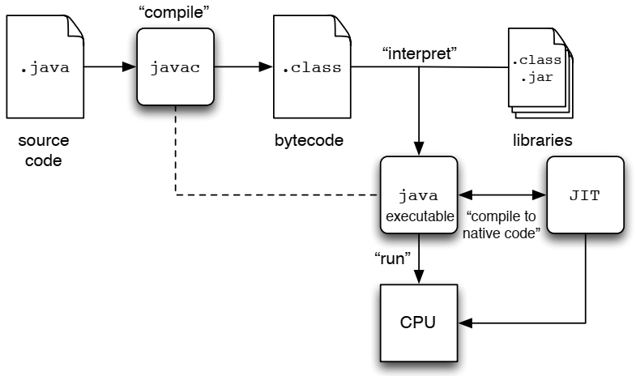
{: .slide}

> ## 8. How C programs run
>
> 
{: .slide}

> ## 9. Hands-on: Getting started
>
> - Open a terminal (Windows Terminal or Mac Terminal).  
> - Reminder: It is `podman` on Windows and `docker` on Mac. Everything else 
> is the same!. 
> - Launch the container: 
>
> > ## Windows:
> >
> > ~~~
> > $ podman run --rm --userns keep-id --cap-add=SYS_PTRACE --security-opt seccomp=unconfined -it -p 2222:22 -v /mnt/c/csc231:/home/$USER/csc231:Z localhost/csc-container /bin/bash
> > ~~~
> > {: .language-bash}
> >
> {:.slide}
>
> > ## Mac:
> >
> > ~~~
> > $ podman run --rm --userns keep-id --cap-add=SYS_PTRACE --security-opt seccomp=unconfined -it -p 2222:22 -v /Users/$USER/csc231:/home/$USER/csc231:Z localhost/csc-container /bin/bash
> > ~~~
> > {: .language-bash}
> >
> {:.slide}
> 
{: .slide}

> ## 10. Hands-on: Setup directory
>
> Create a directory named `intro-c` inside your home directory, 
> then change into that directory.
>
> ~~~
> $ cd ~/csc231
> $ pwd
> $ mkdir intro-c
> $ ls
> $ cd intro-c
> $ pwd
> ~~~
> {: .language-bash}
> 
> 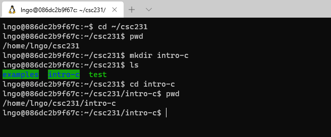
>
{: .slide}

> ## 11. Hands-on: Create hello.c
>
> - Inside the terminal, make suse that you are still inside
> `intro-c`, then use `nano` to create `hello.c`with the source code below. 
>
> ~~~
> $ pwd
> $ nano intro-c
> ~~~
> {: .language-bash}
>
> 
> 
>
> - Once finished editing in `nano`:
>   - first hit `Ctrl-X` (same for both Windows and Mac). 
>   - Next hit `Y` to save modified buffer (new contents). 
>   - Hit `Enter` to save to the same file name as what you opened with. 
> - **Memorize your key-combos!**.
> 
> 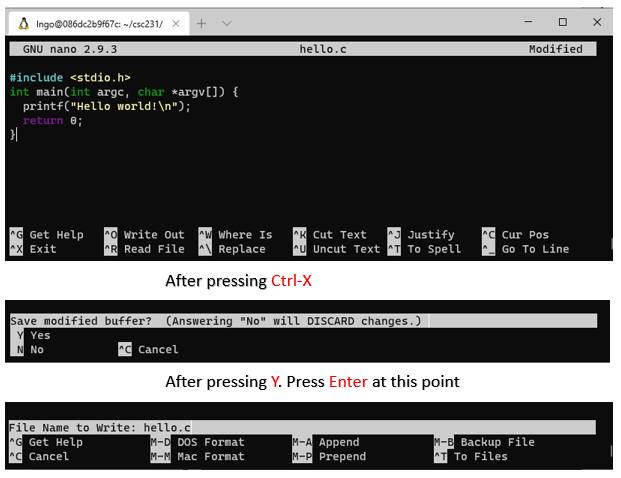
>
> ### What's in the code?
>
> - Line 1: Standard C library for I/O, similar to Java's `import`.
> - Line 2-4: Function declaration/definition for `main`:
>   - Line 2: 
>     - return type: `int`
>     - function name: `main`
>     - parameter list: 
>        - `argc`: number of command line arguments.
>        - `*argv[]`: pointers to array of command line argument strings. 
>    - Line 3: Invoke builtin function `printf` to print out  string `Hello world!`
>    with an end-of-line character `\n`. This is similar to `System.out.printf`.
>    - Line 4: Exit a successfully executed program with a return value of 0. 
>
> {: .language-c}
> 
>
{: .slide}

> ## 12. Hands-on: Simple compile and run
>
> - Similar to `javac`, we use `gcc` to compile C code. 
> - Before compile, make sure that you are still inside `intro-c` in the terminal. 
>
> ~~~
> $ ls
> $ pwd
> $ gcc -o hello hello.c
> $ ls
> $ ./hello
> ~~~
> {: .language-bash}
> 
> 
>
{: .slide}

> ## 13. Hands-on: Compile and show everything
>
> - There are a number of steps from C codes to executable binaries.  
>
> ~~~
> $ ls -l
> $ gcc -save-temps -o hello2 hello.c
> $ ls -l
> $ ./hello2
> ~~~
> {: .language-bash}
> 
> 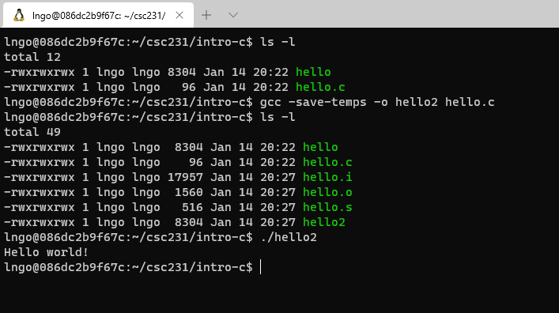
>
{: .slide}

> ## 14. What are those?
>
> - `hello.i`: generated by pre-processor
> - `hello.s`: generated by compiler.
> - `hello.o`: generated by assembler.
> - `hello` (or `hello2`): executable, generated by linker.
> 
> 
>
{: .slide}

> ## 15. Hands-on: View files
>
> - For `hello.i` and `hello.s`, they can be view on the editor. 
> - Run the following command to view `hello.i`
>
> ~~~
> $ cat -n hello.i
> ~~~
> {: .language-bash}
>
> - Run the following command to view `hello.s`
>
> ~~~
> $ cat -n hello.s
> ~~~
> {: .language-bash}
>
> - For `hello.o` and `hello`, we need to dump the binary contents first. 
>
> ~~~
> $ xxd -b hello.o > hello.o.txt
> $ xxd -b hello > hello.txt
> $ ls -l
> ~~~
> {: .language-bash}
> 
> - 
> 
>
> - Run the following command to view `hello.o.txt`
>
> ~~~
> $ cat -n hello.o.txt
> ~~~
> {: .language-bash}
>
> - Run the following command to view `hello.txt`
>
> ~~~
> $ cat -n hello.txt
> ~~~
> {: .language-bash}
>
{: .slide}

> ## 16. Challenge: 
>
> The usage of C's `printf` is similar to Java's `System.out.printf`. Find out how to 
> modify `hello.c` so that the program prints out `Hello Golden Rams!` with each word
> on a single line. The program should use exactly one `printf` statement. 
>
> > ## Answer
> >     
> >  
> >
> {: .solution}
{: .challenge}

> ## 17. Variables, Addresses, and Pointers
>
> - In Java, you can manipulate the value of a variable via the program but not directly 
> in memory (inside the JVM). 
> - In C, you can retrieve the address of the location in memory where the variable is 
> stored. 
> - The operator `&` (reference of) represents the memory address of a variable.
{: .slide}

> ## 18. Hands-on: Pointer
>
> - Inside the terminal, make suse that you are still inside
> `intro-c`, then use `nano` to create `pointer-1.c`with the source code below. 
>
> 
>
> - `%p` is an output conversion syntax (similar to Java specifiers) for displaying memory 
> address in hex format. See [Other Output Conversions](https://www.gnu.org/software/libc/manual/html_node/Other-Output-Conversions.html#Other-Output-Conversions) for more 
> details.
> - Compile and run `pointer-1.c`
> 
> ~~~
> $ ls
> $ gcc -o pointer-1 pointer-1.c
> $ ./pointer-1
> ~~~
> {: .language-bash}
>
> 
>
{: .slide}

> ## 19. Pointer Definition
>
> - Pointer is a variable that points to a memory location (contains a memory location).  
>   - We can them *pointer variables*. 
> - A pointer is denoted by a `*` character. 
> - The type of pointer must be the same as that of the value being stored in 
> the memory location (that the pointer points to).
> - If a pointer points to a memory location, how do we get these locations?
>   - An `&` character in front of a variable (includes pointer variables) denotes that
>   variable's address location. 
{: .slide}

> ## 20. Hands-on: Pointer and Variable's Addresses
>
> - Inside the terminal, make suse that you are still inside
> `intro-c`, then use `nano` to create `pointer-2.c`with the source code below. 
>
> 
> 
> - Since `p_i` is a pointer variable, `p_i` contains a memory address (hence `%p`).
> - Then, `*p_i` will point to **the value in the memory address contained in p_i**. 
>   - This is referred to as *de-referencing*. 
>   - This is also why the type of a pointer variable must match the type of data stored
>   in the memory address the pointer variable contains. 
> - Compile and run `pointer-2.c`
> 
> 
>
{: .slide}

> ## 21. Pass by Value and Pass by Reference
>
> - Parameters are passed to functions. 
> - Parameters can be value variables or pointer variables. 
> - What is the difference?  
{: .slide}

> ## 22. Hands-on: Pass by value
>
> - Inside the terminal, make suse that you are still inside
> `intro-c`, then use `nano` to create `pointer-3.c`with the source code below. 
>
> 
>
> - Compile and run `pointer-3.c`
> 
> 
>
{: .slide}

> ## 23. Hands-on: Pass by reference
>
> - Inside the terminal, make suse that you are still inside
> `intro-c`, then use `nano` to create `pointer-4.c`with the source code below. 
>
> 
>
> - Compile and run `pointer-4.c`
> 
> 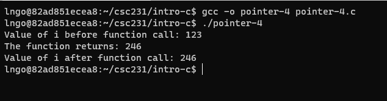
>
{: .slide}

> ## 24. Question
>
> In Java, do you pass by value or pass by reference?
>
> > ## Answer     
> > - Primitives are passed by value. 
> > - Objects are passed by reference. 
> >
> {: .solution}
{: .challenge}

> ## 25. Pointers and memory allocation
>
> - How does C request dynamic memory when you don't know at 
> compile-time exactly what you will need?
> - How does C allocate memory?
>   - Automatic: compile arranges for memory to be allocated 
>   and initialized for local variables when it is in scope.
>   - Static: memory for static variables are allocated once 
>   when program starts.
>   - Dynamic: memory is allocated on the fly as needed.
{: .slide}

> ## 26. Dynamic memory allocation
>
> - Unlike Java, you have to do everything!
>   - Ask for memory.
>   - Return memory when you are done (garbage collection!).
> - C function: [`malloc`](https://linux.die.net/man/3/malloc)
>   - `void *malloc(size_t size);`
>   - The `malloc()` function allocates `size` bytes and returns 
>   a pointer to the allocated memory. The memory is **not initialized**. 
>   If size is 0, then `malloc()` returns either `NULL`, or a unique 
>   pointer value that can later be successfully passed to `free()`.
> - C function: [`free`](https://linux.die.net/man/3/free)
>   - void free(void *ptr);
>   - The `free()` function frees the memory space pointed to by ptr, 
>   which must have been returned by a previous call to `malloc()`, 
>   `calloc()` or `realloc()`. Otherwise, or if `free(ptr)` has already 
>   been called before, undefined behavior occurs. If `ptr` is `NULL`, 
>   no operation is performed.
{: .slide}

> ## 27. Void pointer
>
> - When `malloc` allocates memory, it returns a sequence of bytes, with
> no predefined types. 
> - A pointer that points to this sequence of bytes (the address of the 
> starting byte), is called a **void pointer**.  
> - A void pointer will then be typecast to an appropriate type. 
{: .slide}

> ## 28. Hands-on: malloc and type cast
>
> - Inside the terminal, make suse that you are still inside
> `intro-c`, then use `nano` to create `malloc-1.c`with the source code below. 
>
> 
>
> - What points to where:
>   - `void *p = malloc(4);`: allocate 4 contiguous bytes. The address of the
>   first byte is returned and assign to pointer variable `p`. `p` has no 
>   type, so it is a `void pointer`. 
>   - `int *ip = (int *)p;`: The address value *pointed to* by `p` is assigned
>   to pointer variable `ip`. The bytes pointed to be `p` are now casted to 
>   type `int`. 
> - Compile and run `malloc-1.c`
> 
> 
>
{: .slide}

> ## 29. Hands-on: malloc and type cast with calculation
>
> - Inside the terminal, make suse that you are still inside
> `intro-c`, then use `nano` to create `malloc-2.c`with the source code below. 
>
> 
>
>
> - Only ask for exactly what you need!
> - Compile and run `malloc-2.c`
> 
> 
>
{: .slide}

> ## 30. Hands-on: Safety
>
> - Inside the terminal, make suse that you are still inside
> `intro-c`, then use `nano` to create `malloc-3.c`with the source code below. 
>
> 
>
>
> - Return and free memory after you are done!
> - Compile and run `malloc-3.c`
> 
> 
>
{: .slide}

> ## 31. Dynamic memory allocation
>
> - Critical to support complex data structures that grow as the 
>  program executes. 
> - In Java, custom classes such as ArrayList and Vector provide 
> such support.
> - In C, you have to do it manually: How?
> - Let’s start with a simpler problem:
>   - How can we dynamically allocate memory to an array 
>   whose size is not known until during run time?
{: .slide}

> ## 32. Hands-on: What does an array in C look like?
>
> - Inside the terminal, make suse that you are still inside
> `intro-c`, then use `nano` to create `array-1.c`with the source code below. 
>
> 
>
>
> - What is the distance between addresses? Why?
> - Compile and run `array-1.c`
> 
> 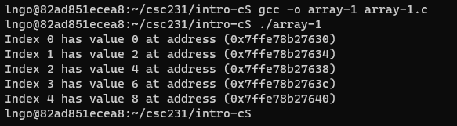
>
{: .slide}

> ## 33. Exercise
>
> - Create a copy of `array-1.c` called `array-2.c`. 
> - Change the type of `numbers` to `double`. 
> - What is the address step now?
>
> > ## Answer    
> >
> >  
> > 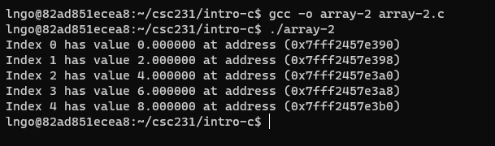 
> > 
> {: .solution}
{: .challenge}

> ## 34. An array variable
>
> - ... is in fact pointing to an address containing a value. 
> - ... without the bracket notation and an index points to the 
> corresponding address of the value at the index. 
> - ... is quite similar to a pointer!
{: .slide}

> ## 35. Hands-on: Array as pointer (or vice versa ...)
>
> - Inside the terminal, make suse that you are still inside
> `intro-c`, then use `nano` to create `array-3.c`with the source code below. 
>
> 
>
> - Compile and run `array-3.c`
> 
> 
>
{: .slide}

> ## 36. Hands-on: Dynamic array creation with command line arguments. 
>
> - Inside the terminal, make suse that you are still inside
> `intro-c`, then use `nano` to create `array-4.c`with the source code below. 
>
> 
>
>
> - In C, the command line arguments **include** the program's name. The
> actual arguments start at index position 1 (not 0 like Java).
> - Compile and run `array-4.c`
> 
> 
>
{: .slide}

> ## 37. Hands-on: String 
>
> - Inside the terminal, make suse that you are still inside
> `intro-c`, then use `nano` to create `string-1.c`with the source code below. 
>
> 
>
> - Compile and run `string-1.c`
> 
> 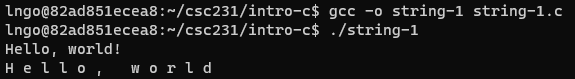
>
> - In C, string is considered an array of characters.
>
{: .slide}

> ## 38. Hands-on: Array of strings
>
> - Inside the terminal, make suse that you are still inside
> `intro-c`, then use `nano` to create `string-2.c`with the source code below. 
>
> 
>
> - Compile and run `string-2.c`
> 
> 
>
{: .slide}

> ## 39. Object in C
>
> - C has no classes or objects. 
> - Instead, it has `struct` type (think ancestor of objects) .
{: .slide}

> ## 40. Hands-on: Struct in C
>
> - Inside the terminal, make suse that you are still inside
> `intro-c`, then use `nano` to create `struct-1.c`with the source code below. 
>
> 
>
> - Compile and run `struct-1.c`
> 
> 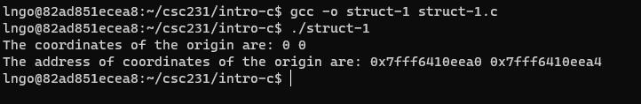
>
{: .slide}

> ## 41. Hands-on: Struct of structs in C
>
> - Inside the terminal, make suse that you are still inside
> `intro-c`, then use `nano` to create `struct-2.c`with the source code below. 
>
> 
>
> - Compile and run `struct-2.c`
> 
> 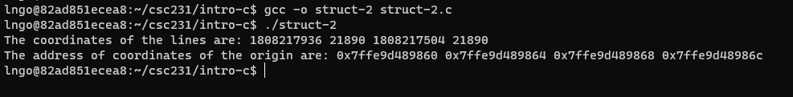
>
{: .slide}

> ## 42. Function in C
>
> - Almost the same as methods in Java, except for one small difference. 
> - They need to either be declared, or must be defined prior to being
> called (relative to written code position). 
{: .slide}

> ## 43. Hands-on: Functions in C - definition and declaration
>
> - Create three C files, `function-1.c`, `function-2.c`, and `function-3.c`,
> with the source codes below:
>
> 
> 
> 
>
> - Compile and run these files. 
> 
> 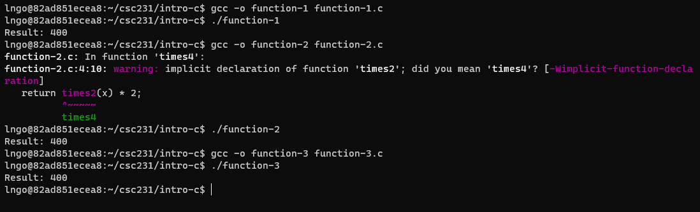
>
{: .slide}



