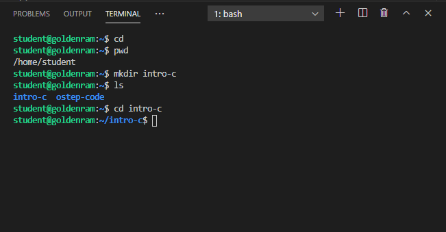
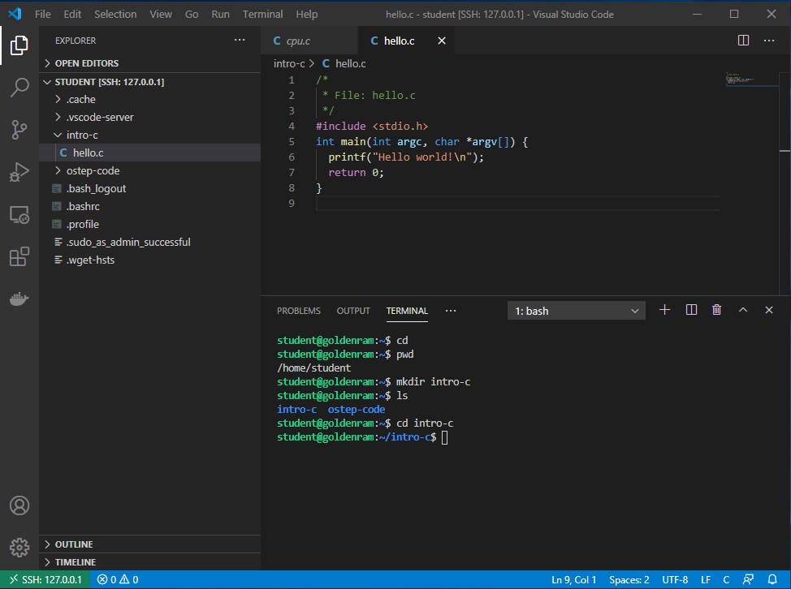
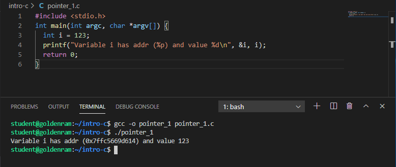

> ## What is C?     
>  
> - Developed by Dennis Ritchie at Bell Labs
> - First public released in 1972. 
> - **The** book: *The C programming languange" by Dennis M. Ritchie and Brian W. Kernighan. 
> Prentice Hall 1988. 
{: .slide}

> ## How to learn C (now that you already know Java)?     
>  
> - [C for Java programmers][c4java]
> - [C programming vs. Java programming][c_vs_java]
{: .slide}

> ## Scary stuff ahead ...     
>  
> - C is much less supportive for programmers than Java.
> - (Much) easier to make mistake, and (much) harder to fix. 
{: .slide}

> ## But it is exciting ...     
>  
> - C requires less memory resources than Java.
> - C, in many instances, runs faster than Java. 
> - Knowing C will make you a better programmer overall. 
{: .slide}

> ## Similarities (or mostly similar) between C and Java     
>  
> - Values, types, literals, expressions
> - Variables
> - Control flow (if, switch, while, for, do-while)
> - Call-return: parameters, arguments, return values
> - Arrays (mostly)
> - Primitive and reference types
> - Type casting. 
> - Library usage. 
{: .slide}

> ## Differences between C and Java     
>  
> - C has no classes or objects (but something similar)
> - C is not object-oriented. 
> - C arrays are simpler:
>   - No boundary checking. 
>   - No knowledge of array's own size. 
> - String operations are limited. 
> - No collections, exceptions, or generics. 
> - No automatic memory management. 
> - **Pointers!!!**
{: .slide}

> ## How Java programs run
>
> 
{: .slide}

> ## How C programs run
>
> 
{: .slide}

> ## Hands-on 1: Getting started
>
> - Start the csc331 VM in headless mode. 
> - Connect VSCode to csc331. 
> - Navigate to `/home/student/
> - Open a terminal
{: .slide}

> ## Hands-on 2: Setup directory
>
> Create a directory named `intro-c` inside `/home/student`, 
> then change into that directory.
>
> ~~~
> $ cd
> $ pwd
> $ mkdir intro-c
> $ ls
> $ cd intro-c
> ~~~
> {: .language-bash}
> 
> 
>
{: .slide}

> ## Hands-on 3: Create hello.c
>
> - In the **EXPLORER** window, right-click on `intro-c` and select `New File`.
> - Type `hello.c` as the file name and hits Enter. 
> - Enter the following source code in the editor windows:
> - Save the file when you are done: 
>   - `Ctrl-S` for Windows/Linux
>   - `Command-S` for Macs
> - **Memorize your key-combos!**.
>
> ~~~
> /*
>  * File: hello.c
>  */
> #include <stdio.h>
> int main(int argc, char *argv[]) {
>   printf("Hello world!\n");
>   return 0;
> }
> ~~~
> {: .language-c}
> 
> 
>
{: .slide}

> ## What's in the code?
>
> - Line 1-3: Comments, similar to Java.
> - Line 4: Standard C library for I/O, similar to Java's `import`.
> - Line 5-8: Function declaration for `main`:
>   - Line 5: 
>     - return type: `int`
>     - function name: `main`
>     - parameter list: 
>        - `argc`: number of command line arguments.
>        - `*argv[]`: pointers to array of command line argument strings. 
>    - Line 6: Invoke builtin function `printf` to print out  string `Hello world!`
>    with an end-of-line character `\n`. This is similar to `System.out.printf`.
>    - Line 7: Exit a successfully executed program with a return value of 0. 
>
> {: .language-c}
> 
> 
>
{: .slide}

> ## Hands-on 4: Simple compile and run
>
> - Similar to `javac`, we use `gcc` to compile C code. 
> - Before compile, make sure that you are still inside `intro-c` in the terminal. 
>
> ~~~
> $ pwd
> $ ls
> $ gcc -o hello hello.c
> $ ls
> $ ./hello
> ~~~
> {: .language-bash}
> 
> 
>
{: .slide}

> ## Hands-on 4: Compile and show everything
>
> - There are a number of steps from C codes to executable binaries.  
>
> ~~~
> $ ls
> $ gcc -save-temps -o hello2 hello.c
> $ ls -l
> $ ./hello2
> ~~~
> {: .language-bash}
> 
> 
>
{: .slide}

> ## What are those?
>
> - `hello.i`: generated by pre-processor
> - `hello.s`: generated by compiler.
> - `hello.o`: generated by assembler.
> - `hello`: executable, generated by linker.
> 
> 
>
{: .slide}

> ## Hands-on 5: View files
>
> - For `hello.i` and `hello.s`, they can be view on the editor. 
> - For `hello.o` and `hello`, we need to dump the binary contents first. 
>
> ~~~
> $ xxd -b hello.o > hello.o.txt
> $ xxd -b hello > hello.txt
> $ ls -l
> ~~~
> {: .language-bash}
> 
> - 
> 
>
{: .slide}

> ## Variables, Addresses, and Pointers
>
> - In Java, you can manipulate the value of a variable via the program but not directly 
> in memory (inside the JVM). 
> - In C, you can retrieve the address of the location in memory where the variable is 
> stored. 
> - The operator `&` (reference of) represents the memory address of a variable.
{: .slide}

> ## Hands-on 6: Pointer
>
> - In the **EXPLORER** window, right-click on `intro-c` and select `New File`.
> - Type `pointer_1.c` as the file name and hits Enter. 
> - Enter the following source code in the editor windows:
>
> ~~~
> #include <stdio.h>
> int main(int argc, char *argv[]) {
>   int i = 123;
>   printf("Variable i has addr (%p) and value %d\n", &i, i);
>   return 0;
> }
> ~~~
> {: .language-c}
> 
> - `%p` is an output conversion syntax (similar to Java specifiers) for displaying memory 
> address in hex format. See [Other Output Conversions][gcc_output_conversion] for more 
> details.
> - Compile and run `pointer_1.c`
> 
> 
>
{: .slide}

> ## Pointer Definition
>
> - Pointer is a variable that points to a memory location (contains a memory location).  
>   - We can them *pointer variables*. 
> - A pointer is denoted by a `*` character. 
> - The type of pointer must be the same as that of the value being stored in 
> the memory location (that the pointer points to).
> - If a pointer points to a memory location, how do we get these locations?
>   - An `&` character in front of a variable (includes pointer variables) denotes that
>   variable's address location. 
{: .slide}

> ## Hands-on 7: Pointer and Variable's Addresses
>
> - In the **EXPLORER** window, right-click on `intro-c` and select `New File`.
> - Type `pointer_2.c` as the file name and hits Enter. 
> - Enter the following source code in the editor windows:
>
> ~~~
> #include <stdio.h>
> int main(int argc, char *argv[]) {
>   int i = 123;
>   int *p_i = &i;
>   printf("Variable i has addr (%p) and value %d\n", &i, i);
>   printf("The pointer points to addr (%p) containing value %d\n", p_i, *p_i);
>   return 0;
> }
> ~~~
> {: .language-c}
> 
> - Since `p_i` is a pointer variable, `p_i` contains a memory address (hence `%p`).
> - Then, `*p_i` will point to **the value in the memory address contained in p_i**. 
>   - This is referred to as *de-referencing*. 
>   - This is also why the type of a pointer variable must match the type of data stored
>   in the memory address the pointer variable contains. 
> - Compile and run `pointer_2.c`
> 
> 
>
{: .slide}

> ## Pass by Value and Pass by Reference
>
> - Parameters are passed to functions. 
> - Parameters can be value variables or pointer variables. 
> - What is the difference?  
{: .slide}

> ## Hands-on 8: Pass by value
>
> - In the **EXPLORER** window, right-click on `intro-c` and select `New File`.
> - Type `pointer_3.c` as the file name and hits Enter. 
> - Enter the following source code in the editor windows:
>
> ~~~
> #include <stdio.h>
>
> int pass_by_value(int i) {
>    i = i * 2;
>    return i;
> }
>
> int main(int argc, char *argv[]) {
>   int i = 123;
>   printf("Value of i before function call: %d\n", i);
>   printf("The function returns: %d\n", pass_by_value(i)); 
>   printf("Value of i after function call: %d\n", i);
>   return 0;
> }
> ~~~
> {: .language-c}
>
> - Compile and run `pointer_3.c`
> 
> 
>
{: .slide}

> ## Hands-on 9: Pass by reference
>
> - In the **EXPLORER** window, right-click on `intro-c` and select `New File`.
> - Type `pointer_4.c` as the file name and hits Enter. 
> - Enter the following source code in the editor windows:
>
> ~~~
> #include <stdio.h>
>
> int pass_by_ref(int *a_pointer) {
>   *a_pointer = (*a_pointer) * 2;
>   return *a_pointer;
> }
>
> int main(int argc, char *argv[]) {
>   int i = 123;
>   printf("Value of i before function call: %d\n", i);
>   printf("The function returns: %d\n", pass_by_ref(&i)); 
>   printf("Value of i after function call: %d\n", i);
>   return 0;
> }
> ~~~
> {: .language-c}
>
> - Compile and run `pointer_4.c`
> 
> 
>
{: .slide}

> ## Question
>
> In Java, do you pass by value or pass by reference?
>
> > ## Answer     
> > - Primitives are passed by value. 
> > - Objects are passed by reference. 
> >
> {: .solution}
{: .challenge}


