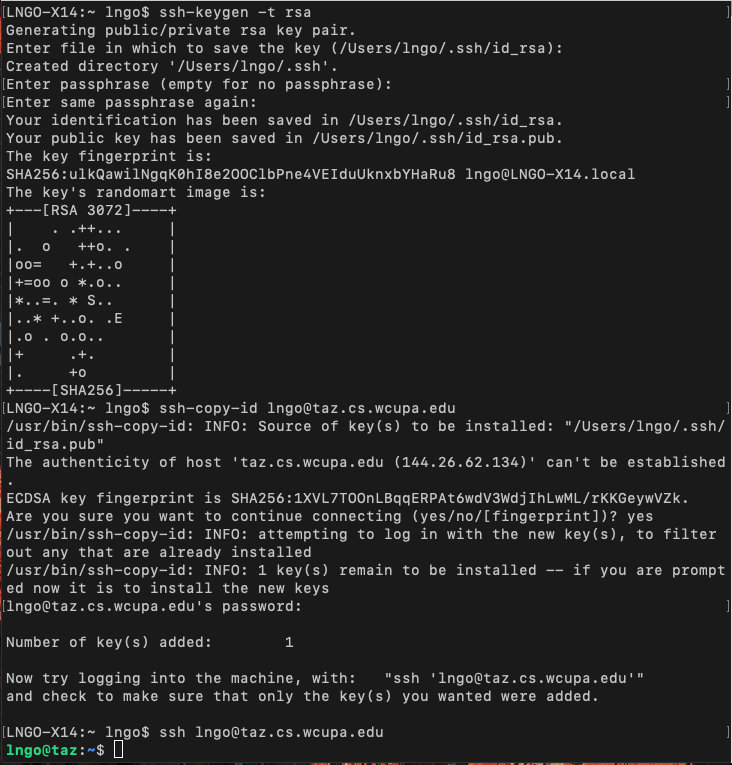

## Setup passwordless SSH to taz

- Generate passwordless public/private RSA keys on your personal machine where you want to SSH into taz. 
- Accept **all** default selections, and **do not** provide a password when asked.  

~~~
$ cd
$ ssh-keygen -t rsa
~~~
{: .language-bash}

- Next, run `ssh-copy-id YOUR_TAZ_LOGINID@taz.cs.wcupa.edu` to copy the key over to `taz`. You will be asked for your taz password. 
- If you are asked for authenticity of host `taz.cs.wcupa.edu (144.26.26.134)`, enter `Yes`. 

~~~
$ ssh-copy-id lngo@taz.cs.wcupa.edu
~~~
{: .language-bash}

- When key copying is done correctly, you will not need to provide a password
when SSH to taz:

~~~
$ ssh lngo@taz.cs.wcupa.edu
lngo@taz:~$
~~~
{: .language-bash}


