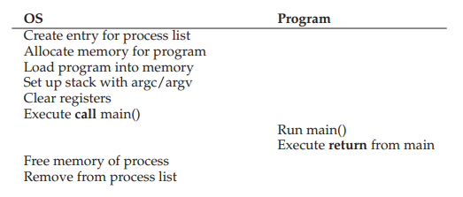

# Limited Direct Execution

```{admonition} Key concept
:class: tip

Virtualization of the CPU must be done in an efficient manner. At the same time, 
the OS must retain control over the system. This is accomplished by combining user/kernel
modes, trap table, timer interrupt, and context switching.

```


## 1. CPU virtualization recall
- To support the illusion of having multple processes running concurrently on 
a single physical CPU, we can have the CPU run one process for a while, then run
another, and so on.
- This is called **time sharing**. 


## 2. Design goals of CPU virtualization
- Performance
  - The process can be itself and run as fast as possible without frequent 
  interaction with the OS.
- Control
  - We want to avoid the scenario where a process can run forever and take over 
  all the machine's resources or a process performs unauthorized actions. This 
  requires interaction with the OS. 


## 3. The question!

How to **efficiently** virtualize the CPU with **control**?


## 4. Efficient

- The most efficient way to execute a process is through direct execution. 



- Once the program begins to run, the OS becomes a complete outsider.
- No control over the running program.
- **Problem 1**: The program can access anything it wants to, including restricted operations 
(direct access to hardware devices, especially I/O for unauthorized purposes).
- **Problem 2**: The program may never switch to a different process without explicit. 
instructions in main(), thus defeating the purposes of time-sharing.

## 5. Problem 1: working with restricted operations
- The process **should be able to perform restricted operations**, such as disk I/O, 
open network connections, etc.
- But we should not give the process complete control of the system.
- Rephrase: The process **should be able to have its restricted operations performed**.
- Solution: hardware support via processor modes
  - User mode
  - Kernel mode

## 6. Process modes
- A **mode bit** is added to hardware to support distinguishing between user mode 
and kernel mode. 
- Some instructions are designated as privileged instructions that cannot be run 
in user mode (only in kernel mode). 
- A user-mode process trying to perform privileged instructions will raise a protection 
fault and be killed. 
- How can these instructions be called by a process in user-mode? 
  - **System calls**


## 7. System calls

- A small set of APIs for restricted operations.
  - [XV6 system calls](https://github.com/mit-pdos/xv6-public/blob/master/syscall.h)
  - Linux x86_64 has 335 systems called (0 to 334) - Last commit June 2, 2018.
  - Linux uses a **sys_call_table** to keep the syscall handlers.
  - [Syscall_64.tbl](https://github.com/torvalds/linux/blob/6f0d349d922ba44e4348a17a78ea51b7135965b1/arch/x86/entry/syscalls/syscall_64.tbl)
- These system calls enable user-mode process to have restricted operations performed 
without having to gain complete control over the system.


## 8. How does a system call happen?

- To make a system call, the process need to switch from user mode to kernel mode, do 
the privileged operation, and then switch back.
- This is done through hardware support
  - Require assembly instructions
  - **trap**: go from user mode to kernel mode.
  - **return-from-trap**: go back from kernel mode to user mode.


## 9. System calls versus normal C calls?

- Function declarations are the same
- System calls
  - Have **trap instruction** in them
  - have extra level of indirection (movements between modes).
  - perform restricted operations
  - have bigger overhead and are slower than equivalent function calls.
  - can use kernel stack.


## 10. Names of system calls

- User space definition:
  - [libc's definition for write()](https://sourceware.org/git/?p=glibc.git;a=blob_plain;f=io/write.c;hb=HEAD)
- Kernel definition:
  - [Linux definition for write()](https://github.com/torvalds/linux/blob/74673fc50babc9be22b32c4ce697fceb51c7671a/include/linux/syscalls.h)
- The user space definition will eventually call the kernel definition.


## 11. Problem 2: switching processes

- A free running process may never stop or switch to another process.
- OS needs to control the process, but how?
  - Once a process is running, OS is NOT running (OS is but another process)
- The question: How can OS regain control of the CPU from a process so that it can switch to another process?


## 12. First approach: cooperative processes

- All programmers promise to insert yield() into their code to give up CPU resources to 
other people's program.
- We have solved the problem and achieved eternal world peace.
- Even in a perfect world, what happens if a process falls into an infinite loop prior 
to calling yield()?
- Collaborative multitasking (Windows 3.1X, Mac PowerPC)


## 13. Second approach: non-cooperative processes

- Similar to processor modes, the hardware once again provided assistance via 
**timer interrupt.**
- A timer device can be programmed to raise an interrupt periodically.
- When the interrupt is raised, the running process stops, a pre-configured 
interrupt handler in the OS runs.
- The OS regains control.


## 14. Second approach: non-cooperative processes

- The OS first decides which process to switch to (with the help from the **scheduler**).
- The OS executes a piece of assemble code (context switch).
  - Save register values of the currently running process into its kernel stack.
  - Restore register values of the soon running process from its kernel stack.


