> ## To do
> To prepare for this course, the following tasks need to be carried out:
> - Installation of Visual Studio Code (VSCode)
> - Installation of VirtualBox
> - Setup CSC331 virtual image, link it to VSCode. 
> - Setup GitHub account
{: .checklist}

## Installation of VSCode

- Go to [VSCode's download page][vscode] and download the correct package for your computer (Windows, Mac OS, or Linux). 
- For Windows, you can download `User Installer 64-bit` version if you only want to install VSCode into your user account.  

## Installation of VirtualBox

- To emulate an operating system, we will use VirtualBox.
- Even if you are already running Linux or Linux/Unix-based OSes (e.g., Mac, ChromeOS ...), 
it is necessary to use VirtualBox to create an isolated environment for operating system.
- The installation file can be downloaded from [VirtualBox's Download Page][virtualbox].
- Install VirtualBox by following the [online instruction page](https://www.virtualbox.org/manual/UserManual.html#installation).


## Setup CSC331 virtual image

- Download the disk image from the following link: [http://bit.ly/2GzKM3e](http://bit.ly/2GzKM3e).
- On the menu bar of VirtualBox, click **File**, then select **Virtual Media Manager**. 

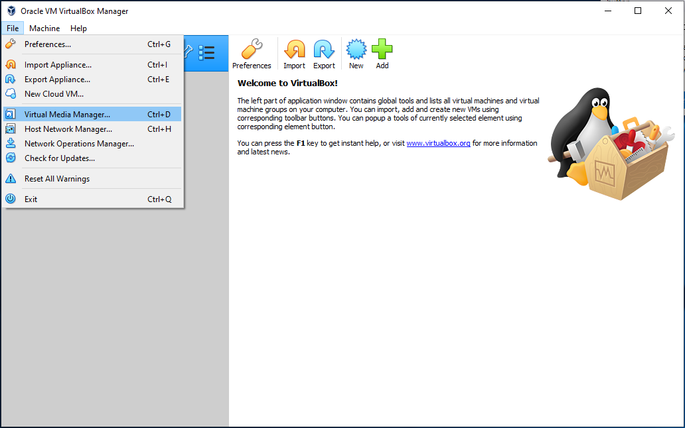

- Click **Add**, navigate to select the downloaded disk image, then click **Open**. 
- Once the image is added, click **Close**. 


- Click **New** to bring up the Create Virtual Machine dialog.
- Type in a **Name** for the virtual machine (csc331).
- You can keep the **Machine Folder** to its default location, or selection another location 
if you have additional hard drives with more space.
  - **Type** is `Linux`
  - **Version** is `Ubuntu (64-bit)`
- Click **Next**

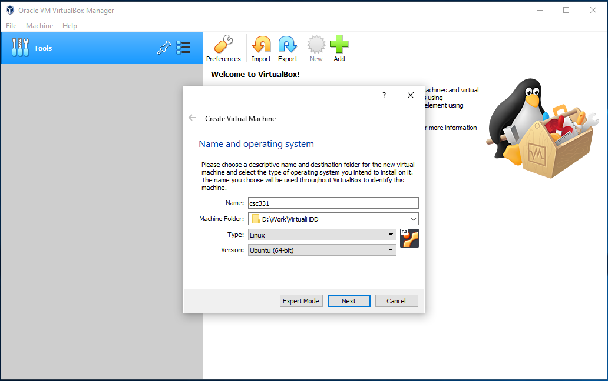

- Memory size can be kept at 521 MB
- Click Next

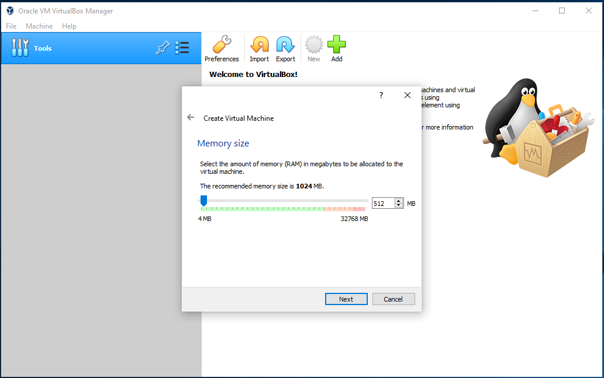

- For Hard disk, click **Use existing virtual hard disk file**
- Select the **ubuntu-server.vdi** file that you added earlier.
- Click **Create**. 

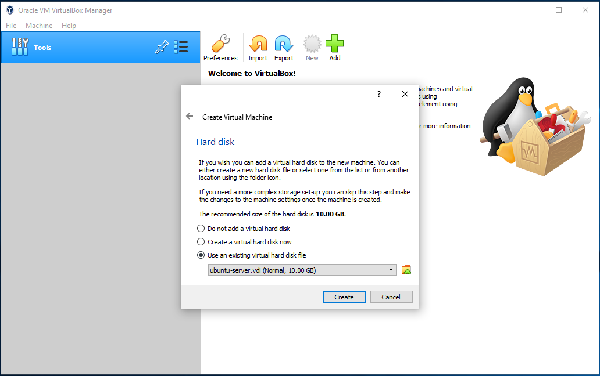

- The VM is now created and appeared on the left windows. 
- Click **OK**
- Next, select the VM and click the yellow **Settings** gear button. 
- Select **Network** then click **Port Forwarding**. 

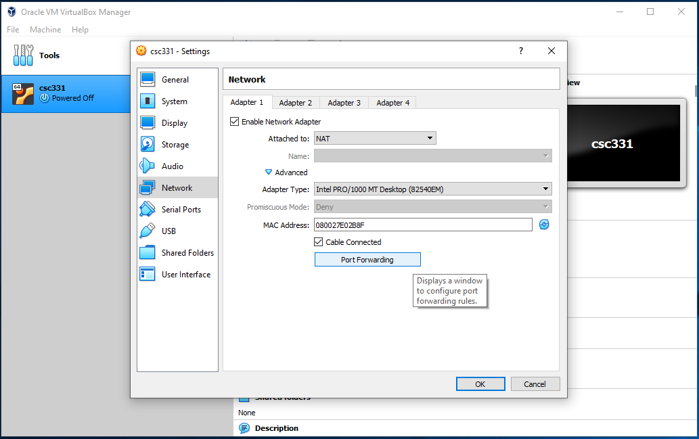

- Click the green **Add rule** button (top right) and enter the information as 
shown in the figure below. 
- Click **OK** when done. 


- Start the VM in **headless** mode, as shown below:


## Working with the image through VSCode 

- Launch VSCode. 
- On the left bar, select the `Extension` button (the button with blocks). 

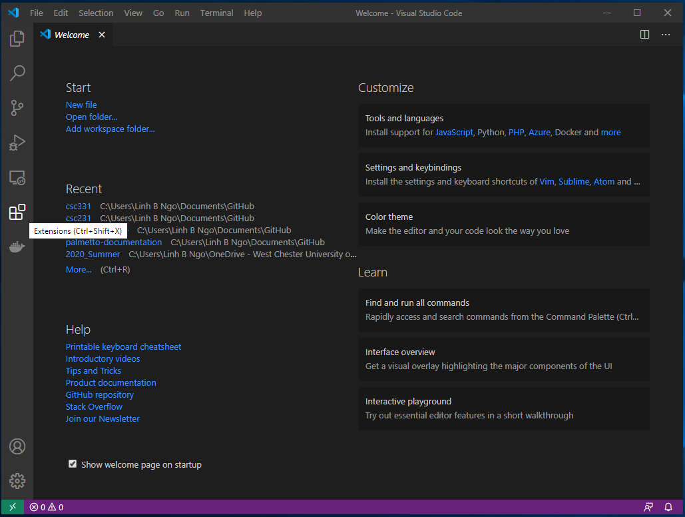

- Type **remote** in the search box.
- Select the **Remote - SSH**, then click `Install`. 

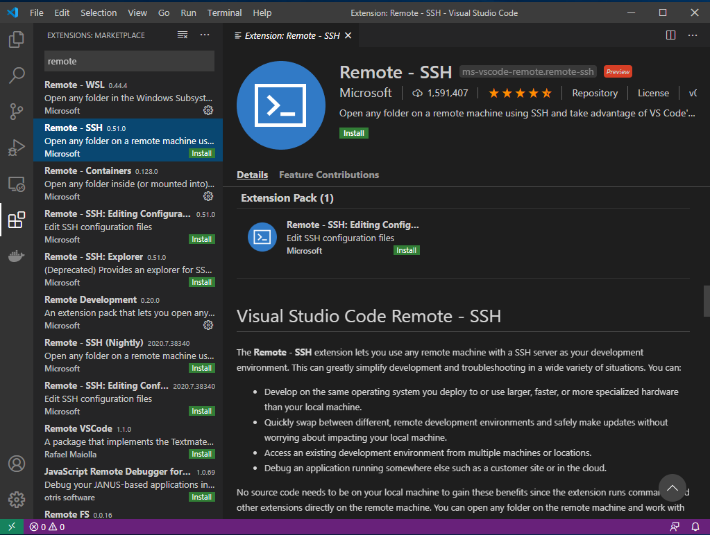

- Once the installation finish, click on the bottom left green button. If you mouse over the button, it shows **Open a remote windows**. 
- Select **Remote-SSH: Connect to Host...**.


- Select **Add New SSH Host...**


- Enter the following into the **Enter SSH Connection Command** box:

```
ssh -p 2222 student@127.0.0.1
```

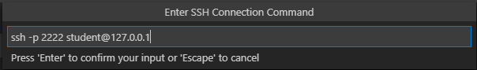

- Select the top option for the **SSH configuration file to update**. 

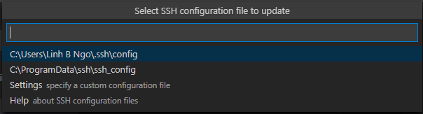

- Next, repeat the step where you clicked the **Open a remote windows** option. 
- This time, the `127.0.0.1` host will show up. 
- Click on this host. 

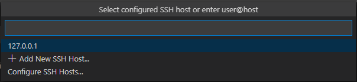

- Select `Linux` as the platform for `127.0.0.1`. 


- Enter `goldenram` as the password for account `student`. 

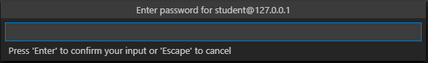

- You should see the bottom left green bar now show the `127.0.0.1` connection. 

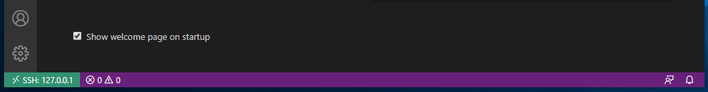

- Click the top left Explorer button. 
- Click `OK`, as we want to open and view the files in `/home/student`. 
- You will be asked to enter the password again. 

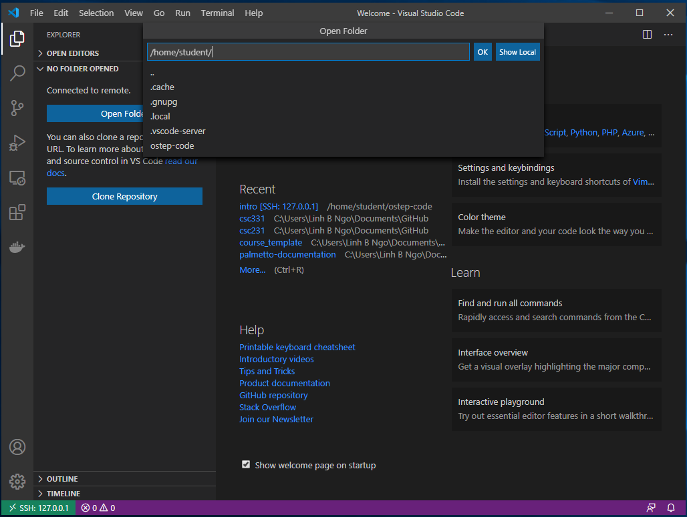

- You will see the files and directories in `/home/student` in the left windows. 
- Click `Terminal` and select `New Terminal`. 
- A `bash` shell into the VM will be opened. 

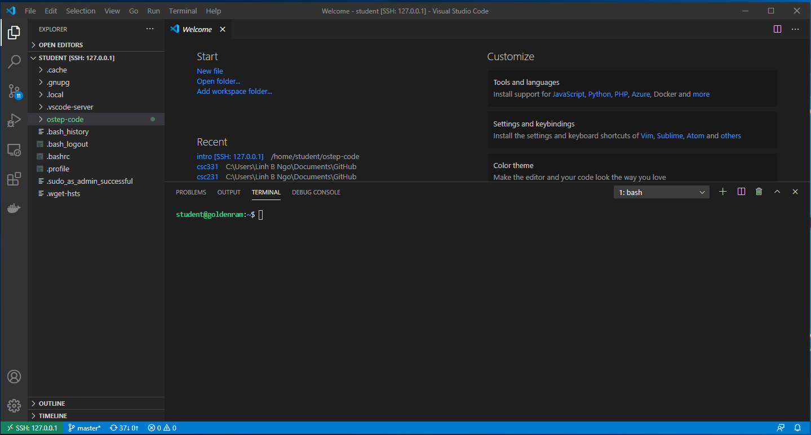

To gracefully shutdown the VM, in the bash terminal, enter `shutdown now`. This will 
shutdown the *headless` VM. 


## Access csc331 directly without VSCode

- VSCode helps making editing codes easier; however, setting up VSCode with csc331 can be
challenging. 
- It is possible to SSH directly into csc331 after port forwarding is created. 
- Caveat: you will need to learn how to use terminal-based editor. 
- To SSH into csc331, the following command can be used on a terminal that has SSH:

~~~
ssh -p 2222 student@127.0.0.1
~~~
{: .language-bash}

By default, MacOS's terminal will have SSH. 
For Windows, you can try to use `PowerShell`. 

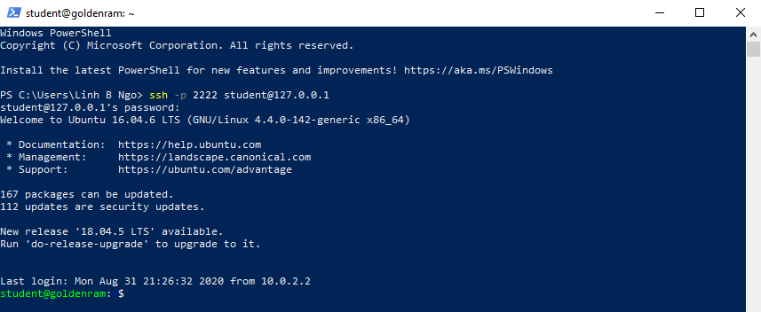


If an error is returned (something to the effect of SSH not found), you will need to download and 
install one of the followings:

- [Download and install Git](https://git-scm.com/downloads), then run `Git Bash` application.


- [Download, unzip, then install MobaXTerm](https://mobaxterm.mobatek.net/download-home-edition.html). Either portable or installer edition is fine. 


- Review [the following document](https://www.howtogeek.com/howto/42980/the-beginners-guide-to-nano-the-linux-command-line-text-editor/) to learn about `nano`, a CLI editor.s


## Setup GitHub account
- If you don't already have a GitHub account, go to [GitHub web page][github] to sign up for an account. 
- It should be noted that you can link multiple email addresses to a GitHub account. Even if you
 already have a GitHub account, you might want to link the account to your WCUPA email. 


