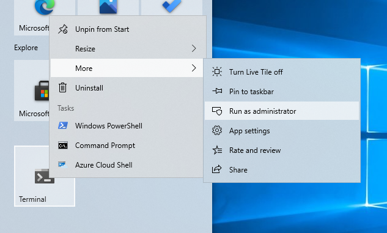
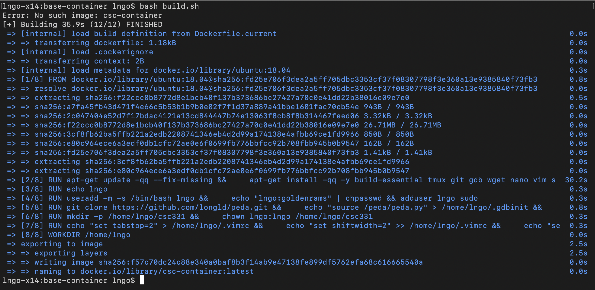

For Windows, we will use the Podman container engine, while for Mac, we will use the Docker container
engine. For the perspective of the class, both engines work the same way, except for the initial 
command (`podman` versus `docker`). All subcommands for both engines are the same.  

> ## Setup Podman on Windows
> 
> - **Make sure that your Windows is up to date prior to completing the remaining steps.**
> - **If you are running on Windows Home, make sure that you switch out of S mode.**
> - The minimal configuration this setup has been tested on is:
>   - Intel Celeron CPU N3550
>   - 4GB memory
>   - Windows 10 Home version 20H2
>
> ### Setup Windows Linux Subsystem
> - Download and install [Windows Terminal from the Microsoft Store](https://www.microsoft.com/en-us/p/windows-terminal/9n0dx20hk701?activetab=pivot:overviewtab).
> - Launch Windows Terminal in `Administrator Mode`. 
> 
> 
>
> - Run the following commands in the terminal:
>  
> ~~~
> $ dism.exe /online /enable-feature /featurename:Microsoft-Windows-Subsystem-Linux /all /norestart
> $ dism.exe /online /enable-feature /featurename:VirtualMachinePlatform /all /norestart
> ~~~
> {: .language-bash}
>
> 
>
> - Restart your computer. 
> - After restarting, download and install [WSL2 Linux kernel update package for x64 machines](https://wslstorestorage.blob.core.windows.net/wslblob/wsl_update_x64.msi).
> - Open another Windows terminal (not in administrator mode) and run
> 
> ~~~
> $ wsl --set-default-version 2
> ~~~
> {: .language-bash}
>
> - Open `Microsoft Store` and search for `Linux`. 
> - We will use `Ubuntu 20.04 LTS` distro. 
> 
> 
>
> - Select `Ubuntu 20.04 LTS` and click `Install`. 
>  
> 
>
> - After finish, click `Launch`. 
> 
> 
>
> - The initial setup will ask you to enter a Linux username and a root password for this distribution. 
>
> 
> 
> - Relaunch your Windows terminal, and you will see `Ubuntu 20.04` available as one of the possible 
> shell options in the dropbox box. 
>  
> 
>
> - In a normal PowerShell shell of Windows terminal, you can check that your Linux subsystem is installed 
> and running by executing
> 
> ~~~
> $ wsl --list --verbose
> ~~~
> {: .language-bash}
> 
> 
>
> ### Setup Podman
> - Launch a `Ubuntu-20.04` shell in Windows Terminal. 
> - Run the following commands (check your typing carefully!)
> 
> ~~~
> $ cd
> $ . /etc/os-release
> $ sudo sh -c "echo 'deb https://download.opensuse.org/repositories/devel:/kubic:/libcontainers:/stable/xUbuntu_${VERSION_ID}/ /' > /etc/apt/sources.list.d/devel:kubic:libcontainers:stable.list"
> $ curl -L https://download.opensuse.org/repositories/devel:/kubic:/libcontainers:/stable/xUbuntu_${VERSION_ID}/Release.key | sudo apt-key add -
> $ sudo apt-get update -qq
> $ sudo apt-get -qq -y install podman
> sudo mkdir -p /etc/containers
> echo -e "[registries.search]\nregistries = ['docker.io','quay.io']" | sudo tee /etc/containers/registries.conf
> sudo cp /usr/share/containers/containers.conf /etc/containers/
> ~~~
> {: .language-bash}
>
> - Open the file `/ect/containers/containers.conf` using your favorite editor . You will need to run the command
> with `sudo`. 
> - Find the options for `cgroup_manager` and `events_logger` (they will be commented out), uncomment, and change
> them to the followings:
> 
> ~~~
> cgroup_manager = "cgroupfs"
> events_logger = "file"
> ~~~
> {: .language-bash}
>
> - Now you can test the operation of `podman` by first run:
> 
> ~~~
> podman info
> ~~~
> {: .language-bash}
> 
> - The resulting output should give detailed information about your machine and the Linux subsystem being used 
> to run podman. 
> 
> 
>
> - First, we will use `podman` to run the `Hello World` container from `docker.io`. 
> 
> ~~~
> $ podman run hello-world
> $ podman image ls
> ~~~
> {: .language-bash}   
>
> - You should be able to observe how the `hello-world` image is pulled from `docker.io` and run, 
> and how the image remains in your computer image repository afterward. 
>
> 
>
> - Next, we will build and launch the image/container for this course. 
> 
> ~~~
> $ git clone https://github.com/class-master/base-container.git
> $ cd base-container
> $ bash build.sh
> ~~~
> {: .language-bash}
>
> 
> - *Don't worry about the error when you first run the command. It only means that you don't have the image in your local image repository.*
> 
>
> - To test launch the container based on this image, do the followings:
>   - Check that the image exists in your local repository
>   - Create a directory to be shared between the running container and 
>   the host machine. 
>   - Launch the container with the appropriate permission, and test that 
>   contents can be created and shared properly. 
> 
> ~~~
> $ podman image ls
> $ mkdir /mnt/c/csc331
> $ podman run --rm --userns keep-id --cap-add=SYS_PTRACE --security-opt seccomp=unconfined -it -p 2222:22 -v /home/$USER/csc331:/home/$USER/csc331:Z localhost/csc-container /bin/bash
> $ touch csc331/test
> ~~~
> {: .language-bash}
>
> 
>
{: .slide}

> ## Setup Docker for Mac
> - Download and install [Docker Desktop for Mac](https://docs.docker.com/docker-for-mac/install/)
> - Use the Search box (magnifying glass on top-right of your Mac Desktop) to find Docker and run. 
>
> 
>
> - A successful launch of Docker will show a swimming whale carrying containers on
> the top bar of the desktop. 
> 
> 
>
> - First, we will use `docker` to run the `Hello World` container from `docker.io`. 
> 
> ~~~
> $ docker run hello-world
> $ docker image ls
> ~~~
> {: .language-bash}   
>
> - You should be able to observe how the `hello-world` image is pulled from `docker.io` and run, 
> and how the image remains in your computer image repository afterward. 
>
> 
>
> - Next, we will build and launch the image/container for this course. 
> 
> ~~~
> $ git clone https://github.com/class-master/base-container.git
> $ cd base-container
> $ bash build.sh
> ~~~
> {: .language-bash}
>
> 
> - *Don't worry about the error when you first run the command. It only means that you don't have the image in your local image repository.*
>
> - To test launch the container based on this image, do the followings:
>   - Check that the image exists in your local repository
>   - Create a directory to be shared between the running container and 
>   the host machine. 
>   - Launch the container with the appropriate permission, and test that 
>   contents can be created and shared properly. 
> 
> ~~~
> $ docker image ls
> $ mkdir /Users/$USER/csc331
> $ docker run --rm --userns=host --cap-add=SYS_PTRACE --security-opt seccomp=unconfined -it -p 2222:22 -v /Users/$USER/csc331:/home/$USER/csc331:Z csc-container /bin/bash
> $ touch csc331/test
> ~~~
> {: .language-bash}
>
> 
>
{: .slide}


